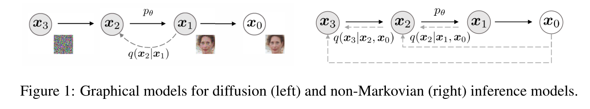

# DENOISING DIFFUSION IMPLICIT MODELS(扩散隐式模型的去噪 )

## Abstract

​	去噪扩散概率模型（DDPM）在没有对抗性训练的情况下实现了高质量的图像生成，但它们需要模拟多个步骤的马尔可夫链才能生成样本。为了加速采样，我们提出了去噪扩散隐式模型（DDIMs），这是一种更有效的迭代隐式概率模型，其训练过程与DDPMs相同。在DDPMs中，生成过程被定义为特定马尔可夫扩散过程的逆过程。我们通过一类导致相同训练目标的非马尔可夫扩散过程来推广DDPM。这些非马尔可夫过程可以对应于确定性的生成过程，从而产生更快生成高质量样本的隐式模型。我们的经验证明，与DDPM相比，DDIMS可以产生高质量的样本，在时间上比DDPM快10倍到50倍，允许我们权衡样本质量的计算，直接在潜在空间中执行语义有意义的图像插值，并以非常低的误差重建观测值。

## 1.Introduction

​	深度生成模型已证明能够在许多领域产生高质量样本（Karras等人，2020；van den  Oord等人，2016a）。在图像生成方面，生成对抗网络（GANs，Goodfello等人（2014））目前显示出比基于似然的方法更高的样本质量，如变分自动编码器（Kingma&Welling，2013）、自回归模型（van  den  Oord等人，2016b）和归一化流（Rezende&Mohamed，2015；Dinh等人，2016）。然而，GAN需要在优化和架构方面进行非常具体的选择，以稳定训练（Arjovsky等人，2017；Gullajani等人，2017年；Karras等人，2018年；Brock等人，2018），并且可能无法涵盖数据分布的模式（Zhao等人，2018）。 

​	最近关于迭代生成模型（Bengio等人，2014年）的工作，如去噪扩散概率模型（DDPM，Ho等人（2020））和噪声条件得分网络（NCSN，Song&Ermon（2019））证明了在不必执行对抗性训练的情况下产生与GANs相当的样本的能力。为了实现这一点，许多去噪自动编码模型被训练以去噪被不同级别的高斯噪声破坏的样本。然后，样本由马尔可夫链生成，马尔可夫链从白噪声开始，逐渐将其去噪为图像。这种生成马尔可夫链过程要么基于Langevin  dynamics（Song&Ermon，2019），要么通过逆转将图像逐渐变为噪声的前向扩散过程而获得（Sohl-Dickstein等人，2015）。

​	这些模型的一个关键缺点是，它们需要多次迭代才能生成高质量的样本。对于DDPM，这是因为生成过程（从噪声到数据）近似于正向扩散过程（从数据到噪声）的反向，这可能有数千个步骤；需要迭代所有步骤来生成单个样本，这比GANs慢得多，GANs只需要一次通过网络。例如，从DDPM采集大小为32×32的50k图像需要大约20小时，但从Nvidia  2080 Ti  GPU上的GAN采集不到一分钟。对于更大的图像，这会变得更加困难，因为在同一个GPU上对大小为256×256的50k图像进行采样可能需要近1000小时。 

​	为了缩小DDPM和GANs之间的效率差距，我们提出了去噪扩散隐式模型（DDIM）。DDM是隐式概率模型（Mohamed&Lakshminarayanan，2016），与DDPM密切相关，因为它们使用相同的目标函数进行训练。 

​	在第3节中，我们将DDPMs使用的前向扩散过程（即马尔可夫过程）推广到非马尔可夫过程，我们仍然能够为其设计合适的逆生成马尔可夫链。我们证明，生成的变分训练目标具有共享的替代目标，这正是用于训练DDPM的目标。因此，我们可以通过选择不同的非马尔可夫扩散过程（第4.1节）和相应的反向生成马尔可夫链，使用相同的神经网络从一大类生成模型中自由选择。特别是，我们能够使用非马尔可夫扩散过程，这导致“短”生成马尔可夫链（第4.2节），可以在少量步骤中进行模拟。这可以仅以样本质量的较小成本大幅提高样本效率。 

​	在第5节中，我们展示了DDMS相对于DDPM的几个经验优势。首先，当我们使用我们提出的方法将采样速度加快10倍到100倍时，与DDPM相比，DDMS具有更好的采样生成质量。第二，DDM样本具有以下“一致性”属性，这对DDPM不适用：如果我们从相同的初始潜在变量开始，并生成具有不同长度的马尔可夫链的多个样本，这些样本将具有类似的高级特征。第三，由于DDMS的“一致性”，我们可以通过操纵DDMS中的初始潜变量来执行语义上有意义的图像插值，这与DDPM不同，DDPM由于随机生成过程而在图像空间附近进行插值。 

## 2.Background

​	给定数据分布$q(x_0)$的样本，我们有兴趣学习近似于$q(x_0)$且易于采样的模型分布$p_\theta(x_0)$。去噪扩散概率模型(DDPMsSohl-Dickstein等人(2015)；Ho等人(2020)）是以下形式的潜在变量模型：
$$
p_\theta(x_0)=\int p_\theta(x_{0:T})dx_{1:T},\quad 其中\quad p_\theta(x_{0:T}):=p_\theta(x_T)\prod_{t=1}^Tp_{\theta}^{(t)}(x_{t-1}|x_t)\qquad(1)
$$
​	其中$x_1,...x_T$是与$x_0$（表示为$\chi$）相同样本空间中的潜在变量。通过最大化变分下限，学习参数$\theta$以拟合数据分布$q(x_0)$：
$$
\max_\theta E_{q(x_0)}[\log p_\theta(x_0)]\leq \max_\theta E_{q(x_0,x_1,...,x_T)}[\log p_\theta(x_{0:T})-\log q(x_{1:T}|x_0)]\qquad(2)
$$
​	其中$q(x_{1:T}|x_0)$是潜在变量上的某种推理分布。与典型的潜在变量模型（如变分自动编码器（Rezende等人，2014））不同，DDPM是用固定（而非可训练）推理过程$q(x_{1:T}|x_0)$学习的，潜在变量是相对高维的。例如，Ho等人（2020）考虑了以下具有高斯变换的马尔科夫链，其由递减序列$\alpha_{1:T}\in(0,1]^T$​参数化:
$$
q(x_{1:T}|x_0):=\prod_{t=1}^Tq(x_t|x_{t-1})\quad其中\quad q(x_t|x_{t-1}):={\cal N}\Bigg(\sqrt{\frac{\alpha_t}{\alpha_{t-1}}}x_{t-1},\Big(1-\frac{\alpha_t}{\alpha_{t-1}}\Big)\pmb{I}\Bigg)\qquad(3)
$$
​	其中确保协方差矩阵在其对角线上具有正相。由于采样过程（从$x_0$到$x_T$）的自回归性质，这被称为正向过程。我们将潜在变量模型$p_\theta(x_{0:T})$称为生成过程，因为它近似于难以处理的正向过程$q(x_{t-1}|x_t)$。直观的说，正向过程逐渐将噪声添加到观测$x_0$，而生成过程逐渐消除噪声观测（图1左图）。

​	正向过程的一个特殊特性是： 
$$
q(x_t|x_0):=\int q(x_{1:t}|x_0)dx_{1:(t-1)}={\cal N}(x_t;\sqrt{\alpha_t}x_0,(1-\alpha_t)\pmb{I});
$$
​	因此，我们可以将$x_t$表示维$x_0$和噪声变量$\epsilon$的线性组合：
$$
x_t=\sqrt{\alpha_t}x_0+\sqrt{1-\alpha_t}\epsilon,\quad其中\quad\epsilon\sim {\cal N}(\pmb 0, \pmb I)\qquad(4)
$$
​	当我们将$\alpha_T$设置为足够接近0时，对于所有$x_0$,$q(x_T|x_0)$收敛到标准高斯，因此自然设置$p_\theta(x_T):=N(\pmb 0, \pmb I)$。如果将所有条件建模为具有可训练均值函数和固定方差的高斯函数，则等式(2)中的目标可以简化为：
$$
L_\gamma(\epsilon_\theta):=\sum_{t=1}^T\gamma_tE_{x_0\sim q(x_0),\epsilon_t\sim {\cal N}(\pmb 0,\pmb I)}[||\epsilon_\theta ^{(t)}(\sqrt{\alpha_t}x_0+\sqrt{1-\alpha_t }\epsilon_t)-\epsilon_t||^2_2]\qquad(5)
$$
​	其中$\epsilon_\theta:=\{\epsilon_\theta ^{(t)} \}_{t=1}^T$是一组$T$函数，每个$\epsilon_\theta ^{(t)}:\chi\rightarrow\chi$（由$t$索引）是具有可训练参数$\theta^{(t)}$的函数，$\gamma:=[\gamma_1,...,\gamma_T]$ 是目标中依赖于$\alpha_{1:T}$的正系数向量。在Ho等人（2020）中，$\gamma=1$的目标被优化，以最大化训练模型的生成能力；这也是基于分数匹配（Hyvärinen,2005;Vincent,2011）的噪声条件分数网络（Song&Ermon）中使用的相同目标。从训练模型中，首先从先验$p_\theta(x_T)$中采样$x_T$，然后从生成过程中迭代采样$x_{t-1}$，最后得到$x_0$。

​	正向过程的长度$T$是DDPMs中的一个重要超参数。从变分的角度来看，较大的$T$允许反向过程接近高斯（Sohl-Dickstein等人，2015），因此用高斯条件分布建模的生成过程成为良好的近似；这促使人们选择大的$T$值，如Ho等人（2020）中的$T=1000$。然而，由于所有T次迭代都必须顺序执行，而不是并行执行，以获得样本$x_0$，因此，从DDPM进行的采样要比从其他深度生成模型进行的采样慢得多，这使得它们对于计算有限且延迟非常关键的任务来说不切实际。

## 3.VARIATIONAL INFERENCE FOR NON-MARKOVIAN FORWARD PROCESSES(非马尔科夫正演变的变分推理)

​	由于生成模型近似于推理过程的反向过程，我们需要重新思考推理过程，以减少生成模型所需要的迭代次数。我们的主要发现是，$L_\gamma$形式的DDPM目标仅取决于边缘分布$q(x_t|x_0)$，而不取决于联合分布$q(x_{1:T}|x_0)$。由于存在许多具有相同边缘分布的推理分布（联合分布），我们探索了非马尔科夫的替代推理过程，这导致了新的生成过程（图1，右侧）。这些非马尔可夫推理过程导致于DDPM相同的代理目标函数，如下所示。在附录A中，我们证明了非马尔科夫视角也适用于高斯情形以外的情形。

### 3.1 NON-MARKOVIAN FORWARD PROCESSES（非马尔科夫链的前向过程）

​	让我们考虑一个由实数向量$\sigma \in \R_{\geq 0}^T$索引的推理分布族$\cal Q$:
$$
q_\sigma(x_{1:T}|x_0):=q_\sigma(x_T|x_0)\prod_{t=2}^Tq_\sigma(x_{t-1}|x_t,x_0)\qquad(6)
$$
​	其中$q_\sigma(x_T|x_0)=\cal N(\sqrt{\alpha_T}x_0,(1-\alpha_T)\pmb I)$，并且所有$t>1$，
$$
q_\sigma(x_{t-1}|x_t,x_0)={\cal N}(\sqrt{\alpha_t-1}x_0+\sqrt{1-\alpha_{t-1}-\sigma_t^2}\cdot\frac{x_t-\sqrt{\alpha_t}x_0}{\sqrt{1-\alpha_t}},\sigma_t^2\pmb I)\qquad(7)
$$
​	选择平均函数以确保$q_\sigma(x_t|x_0)={\cal N}(\sqrt{\alpha_t}x_0,(1-\alpha_t)\pmb I)$对于所有$t$​都成立，以便于定义与所需“边缘分布”匹配的联合推理分布。前向过程可以从贝叶斯规则导出：
$$
q_\sigma(x_t|x_{t-1},x_0)=\frac{q_\sigma(x_{t-1}|x_t,x_0)q_\sigma(x_t|x_0)}{q_\sigma(x_{t-1}|x_0)},\qquad(8)
$$
​	这也是高斯的（尽管我们在本文的其余部分不使用这一事实）。与等式(3)中的扩散过程不同，这里的正向过程不再是马尔可夫过程，因为每个$x_t$可能同时依赖于$x_{t-1}$和$x_0$。$\sigma$的大小控制正向过程的随机性：当$\sigma\rightarrow \pmb0$，我们达到了一个极端情况，只要我们观察$x_0$和$x_t$的某个$t$，那么$x_{t-1}$就变得已知和固定。

### 3.2 GENERATIVE PROCESS AND UNIFIED VARIATIONAL INFERENCE OBJECTIVE（生成过程与同意变分推理目标）

​	接下来，我们定义了一个可训练的生成过程$p_\theta(x_{0:T})$，其中每个$p_\theta^{(t)}(x_{t-1}|x_t)$利用$q_\sigma(x_{t-1}|x_t,x_0)$的知识。直观地说，给定一个噪声观测$x_t$，我们首先对相应的$x_0$进行观测，然后使用它通过反向条件分布$q_\sigma(x_{t-1}|x_t,x_0)$来获得样本$x_{t-1}$，这是我们已经定义的。

​	对于某些$x_0\sim q(x_0)$和$\epsilon_t\sim {\cal N}(\pmb0, \pmb I)$,$x_t$可以由方程(4)获得。然后模型$\epsilon_\theta ^{(t)}(x_t)$尝试在不知道$x_0$的信息的情况下从$x_t$预测$\epsilon_t$。

通过重写方程(4)，就可以预测去噪观测，这是给定$x_t$的$x_0$预测：
$$
 f_\theta ^{(t)}(x_t):=(x_t-\sqrt{1-\alpha_t}\cdot\epsilon_\theta^{(t)}(x_t))/\sqrt{\alpha_t}\qquad(9)
$$
​	我们可以定义具有固定先验$p_\theta(x_T)={\cal N}(\pmb0, \pmb I)$的生成过程，并且
$$
p_\theta^{(t)}(x_{t-1}|x_t)=\begin{cases}{\cal N}(f_\theta^{(1)}(x_1),\sigma_1^2\pmb I)\qquad if\:\:t=1, \\q_\sigma(x_{t-1}|x_t,f_\theta^{(t)}(x_t))\qquad 其他,\end{cases}\qquad(10)
$$
​	其中$q_\sigma(x_{t-1}|x_t,f_\theta^{(t)}(x_t))$是根据方程(7)通过将$x_0$替换为$f_\theta^{(t)}(x_t)$定义的。我们在$t=1$的情况下添加一些高斯噪声（协方差为$\sigma_1^2\pmb I$），以确保生成过程在任何地方都能得到支持。