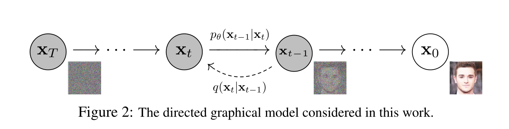

## 1.扩散过程

​	在设定扩散过程使一个马尔科夫链的条件下，向原始信息中不断添加高斯噪声，每一步添加高斯噪声的过程是从$x_{t-1}\rightarrow x_t$，于是定义公式
$$
q(x_t|x_{t-1})={\cal N}(x_t;\sqrt{1-\beta_t}x_{t-1},\beta_t\pmb I)
$$
###### 	该公式表示从$x_{t-1}\rightarrow x_t$是一个以$\sqrt{1-\beta_t}x_{t-1}$为均值，以$\beta_t$为方差的高斯分布变换。

​	利用重参数技巧得到每一个添加高斯噪声的公式如下：
$$
x_t=\sqrt{1-\beta_t}x_{t-1}+\sqrt{\beta_t}Z_t
$$

- $x_t$表示$t$时刻的数据分布

- $Z_t$表示$t$时刻添加的高斯噪声，一般固定是均值为0方差为1的高斯分布

- $\sqrt{1-\beta_t}x_{t-1}$表示当前时刻分布的均值

- $\sqrt{\beta_t}$表示当前时刻分布的标准差。

  ###### 其中$\beta_t$是预先设定0~1之间的常量，故扩散过程不含参。

​	扩散过程中只有一个参数$\beta$，而$\beta$是预先设置的常量，故扩散过程中无未知的需要学习的参数，所以只需要知道初始数据分布$x_0$和$\beta_t$就可以得到任意时刻的分布$x_t$，具体公式如下：

​	$x_t=\sqrt{1-\beta_t}x_{t-1}+\sqrt{\beta_t}Z_t$

​	令$\alpha_t=1-\beta_t$，则$\sqrt{\beta_t}=\sqrt{1-\alpha_t}$，

​	于是$x_t=\sqrt{\alpha_t}x_{t-1}+\sqrt{1-\alpha_t}Z_t\qquad①$

​			$x_{t-1}=\sqrt{\alpha_{t-1}}x_{t-2}+\sqrt{1-\alpha_{t-1}}Z_{t-1}\qquad②$

​								$......$

​	由①，②......得：

​	$x_t=\sqrt{\alpha_t}x_{t-1}+\sqrt{1-\alpha_t}Z_t$

​		 $=\sqrt{\alpha_t}(\sqrt{\alpha_{t-1}}x_{t-2}+\sqrt{1-\alpha_{t-1}}Z_{t-1})+\sqrt{1-\alpha_t}Z_t$

​		 $=\sqrt{\alpha_t\alpha_{t-1}}x_{t-2}+\underbrace{\sqrt{\alpha_t(1-\alpha_{t-1})}Z_{t-1}+\sqrt{1-\alpha_t}Z_t}_{相当于两个高斯分布合并}$

​	因为$Z_t$为均值为0，方差为1的高斯分布，所以$z_{t-1}，z_t$合并后$\mu_t+\mu_{t-1}=0$

方差：$\alpha_t(1-\alpha_{t-1})\sigma_t^2+(1-\alpha_t)\sigma_{t-1}^2=1-\alpha_t\alpha_{t-1}$

故$x_t=\sqrt{\alpha_t\alpha_{t-1}}x_{t-2}+\sqrt{1-\alpha_t\alpha_{t-1}}Z$

令$\overline{\alpha}_t=\alpha_t\alpha_{t-1}\alpha_{t-2}...\alpha_1=\prod_{i=1}^t\alpha_i$

则$x_t=\sqrt{\overline{\alpha}_t}x_0+\sqrt{1-\overline{\alpha}_t}Z$

这里$Z$依然是标准高斯分布。

## 2.逆扩散过程/反向过程

​	扩散过程是将原始数据不断加噪得到高斯噪声，逆扩散过程是从高斯噪声中恢复原始数据，我们假定逆扩散过程仍然是一个马尔科夫链的过程，要做的是$x_t\rightarrow x_0$，故其目标公式如下：
$$
p_\theta(x_{t-1}|x_t)={\cal N}(x_{t-1};\mu_\theta(x_t,t),\sum_\theta(x_t,t))
$$
​	下面推导得到后验条件概率$q(x_{t-1}|x_t,x_0)$：
$$
q(x_{t-1}|x_t,x_0)=\frac{q(x_t,x_{t-1},x_0)}{q(x_t,x_0)}=\frac{q(x_t|x_{t-1},x_0)q(x_{t-1}|x_0)q(x_0)}{q(x_t|x_0)q(x_0)}=\frac{q(x_t|x_{t-1},x_0)q(x_{t-1}|x_0)}{q(x_t|x_0)}\quad①
$$
​	因为逆扩散过程也是一个马尔科夫链的过程，故$q(x_t|x_{t-1},x_0)=q(x_t|x_{t-1})$

​	所以
$$
q(x_t|x_{t-1})={\cal N}(x_{t-1};\sqrt{1-\beta_t}x_{t-1},\beta_t\pmb I)=\frac{1}{\sqrt{2\pi\beta_t}}exp\Big({-\frac{1}{2}\frac{(x_t-\sqrt{\alpha_t}x_{t-1})^2}{\beta_t}}\Big)\propto exp\Big({-\frac{1}{2}\frac{(x_t-\sqrt{\alpha_t}x_{t-1})^2}{\beta_t}}\Big)
$$
​	同理
$$
q(x_{t-1}|x_0)\propto exp\Big(-\frac{1}{2}\frac{(x_{t-1}-\sqrt{\overline{\alpha}_{t-1}}x_0)^2}{1-\overline{\alpha}_{t-1}} \Big)\\
q(x_t|x_0)\propto exp\Big(-\frac{1}{2}\frac{(x_t-\sqrt{\overline{\alpha}_t}x_0)^2}{1-\overline{\alpha}_t} \Big)\qquad②
$$
由①，②得：
$$
q(x_{t-1}|x_t,x_0)\propto exp\Bigg(-\frac{1}{2}\Big(\frac{(x-\sqrt{\alpha_t}x_{t-1})^2}{\beta_t}+\frac{(x_{t-1}-\sqrt{\alpha_{t-1}}x_0)^2}{1-\overline{\alpha}_{t-1}}-\frac{(x_{t-1}-\sqrt{\overline{\alpha}_{t-1}}x_0)^2}{1-\overline{\alpha}_{t-1}}\Big) \Bigg)
$$
对上式进行化简后得
$$
q(x_{t-1}|x_t,x_0)\propto exp\Bigg(-\frac{1}{2}\Big((\frac{\alpha_t}{\beta_t}+\frac{1}{1-\overline{\alpha}_{t-1}})x_{t-1}^2-(\frac{2\sqrt{\alpha_t}}{\beta_t}x_t+\frac{2\sqrt{\overline{\alpha}_t}}{1-\overline{\alpha}_t}x_0)x_{t-1}+C(x_t,x_0) \Big) \Bigg)
$$
根据高斯分布概率密度函数：$f=\frac{1}{\sqrt{2\pi}\sigma}\cdot exp(-\frac{1}{2}\frac{(x-\mu)^2}{\sigma^2})=\frac{1}{\sqrt{2\pi}\sigma}\cdot exp(-\frac{1}{2}\frac{x^2-2\mu x+\mu^2}{\sigma^2})$

于是方差：（注：$\alpha_t=1-\beta_t$，$\overline{\alpha}_t=\prod_{i=1}^t\alpha_i$）
$$
\tilde{\beta_t}=1/(\frac{\alpha_t}{\beta_t}+\frac{1}{1-\overline{\alpha}_{t-1}})=\frac{1-\overline{\alpha}_{t-1}}{1-\overline{\alpha}_t}\cdot \beta_t
$$
均值：
$$
\tilde{\mu}_t(x_t,x_0)=(\frac{\sqrt{\alpha}_t}{\beta_t}x_t+\frac{\sqrt{\overline{\alpha}_t}}{1-\alpha_t}x_0)/(\frac{\alpha_t}{\beta_t}+\frac{1}{1-\overline{\alpha}_{t-1}})=\frac{\sqrt{\alpha_t}(1-\overline{\alpha}_{t-1})}{1-\overline{\alpha}_t}x_t+\frac{\sqrt{\overline{\alpha}_{t-1}}\beta_t}{1-\overline{\alpha}_t}x_0
$$
在逆扩散过程中，模型事先不应当知道$x_0$，因此需要将$x_0$用$x_t$替换掉，由$x_t=\sqrt{\overline{\alpha}_t}x_0+\sqrt{1-\overline{\alpha}_t}Z$，故$x_0$可以表示为：
$$
x_0=\frac{x_t-\sqrt{1-\overline{\alpha}_t}Z}{\sqrt{\overline\alpha}_t}
$$
代入均值公式中，化简后得到后验条件均值：
$$
\tilde{\mu}_t=\frac{1}{\sqrt{\alpha_t}}(x_t-\frac{\beta_t}{\sqrt{1-\overline\alpha}_t}z_t)
$$
在负对数似然函数得基础上加上一个KL散度，就构成了负对数似然函数的上界，上界越小，负对数似然函数越小，那么对数似然就越大。
$$
-\log p_\theta(x_0)\leq -\log p_\theta(x_0)+D_{KL}(q(x_{1:T}|x_0)||p_\theta(x_{1:T}|x_0))\ \ \ \ \ \ \ \ \ \ \ \ \ \ \ \ \ \ \ \ \ \ \ \ \ \ \ \ \ \ \ \ \\
=-\log p_\theta(x_0)+\mathbb{E}_{x_{1:T}\sim q(x_{1:T}|x_0)}\Big[\log\frac{q(x_{1:T}|x_0)}{p_\theta(x_{0:T})/p_\theta(x_0)}\Big]\\
=-\log p_\theta(x_0)+\mathbb{E}_q\Big[\log\frac{q(x_{1:T}|x_0)}{p_\theta(x_{0:T})}+\log p_\theta(x_0)\Big]\quad\ \ \\
=\mathbb{E}_q\Big[\log\frac{q(x_{1:T}|x_0)}{p_\theta(x_{0:T})}\Big]\qquad\qquad\qquad\qquad\qquad\qquad\quad
$$
对上式左右取期望，令
$$
L_{VLB}=\mathbb{E}_{q(x_{0:T})}\Big[\log \frac{q(x_{1:T}|x_0)}{p_\theta(x_{0:T})}\Big]\geq -\mathbb{E}_{q(x_0)}\log p_\theta(x_0)\rightarrow交叉熵
$$
这样就得到了交叉熵的上界$L_{VLB}$，只要最小化$L_{VLB}$就可以最小化交叉熵损失，接下来，可以对交叉熵的上界进行化简，注意
$$
q(x_t|x_{t-1})=q(x_t|x_{t-1},x_0)=\frac{q(x_t,x_{t-1},x_0}{q(x_{t-1},x_0)}=\frac{q(x_{t-1}|x_t,x_0)q(x_t|x_0)q(x_0)}{q(x_{t-1},x_0)}=\frac{q(x_{t-1}|x_t,x_0)q(x_t|x_0)}{q(x_{t-1}|x_0)}
$$
故
$$
L_{VLB}=\mathbb{E}_{q(x_{0:T})}\Big[\log\frac{q(x_{1:T}|x_0)}{p_\theta(x_{0:T})} \Big]\qquad1\qquad\qquad\qquad\qquad\qquad\qquad\qquad\qquad\qquad\qquad\qquad\qquad\qquad\\
=\mathbb{E}_q\Big[\log\frac{\prod_{t=1}^Tq(x_t|x_{t-1})}{p_\theta(x_T)\prod_{t=1}^Tp_\theta(x_{t-1}|x_t)} \Big]\qquad2\qquad\qquad\qquad\qquad\qquad\qquad\qquad\qquad\qquad\quad\ \\
=\mathbb{E}_q\Big[-\log p_\theta(x_T)+\sum_{t=1}^T\log\frac{q(x_t|x_{t-1})}{p_\theta(x_{t-1}|x_t)} \Big]\qquad3\qquad\qquad\qquad\qquad\qquad\qquad\qquad\qquad\ \ \\
=\mathbb{E}_q\Big[-\log p_\theta(x_T)+\sum_{t=2}^T\log\frac{q(x_t|x_{t-1})}{p_\theta(x_{t-1}|x_t)}+\log\frac{q(x_1|x_0)}{p_\theta(x_0|x_1)} \Big]\qquad4\qquad\qquad\qquad\qquad\ \quad\\
=\mathbb{E}_q\Big[-\log p_\theta(x_T)+\sum_{t=2}^T\log(\frac{q(x_{t-1}|x_t,x_0)}{p_\theta(x_{t-1}|x_t)}\cdot \frac{q(x_t|x_0)}{q(x_{t-1}|x_0)})+\log\frac{q(x_1|x_0)}{p_\theta(x_0|x_1)} \Big]\qquad5\quad\\
=\mathbb{E}_q\Big[-\log{p_\theta(x_T)}+\sum_{t=2}^T\log\frac{q(x_{t-1}|x_t,x_0)}{p_\theta(x_{t-1}|x_t)}+\sum_{t=2}^T\log\frac{q(x_t|x_0)}{q(x_{t-1}|x_0)}+\log\frac{q(x_1|x_0)}{p_\theta(x_0|x_1)} \Big]\quad6\\
=\mathbb{E}_q\Big[-\log p_\theta(x_T)+\sum_{t=2}^T\log\frac{q(x_{t-1}|x_t,x_0)}{p_\theta(x_{t-1}|x_t)}+\log\frac{q(x_T|x_0)}{q(x_1|x_0)}+\log\frac{q(x_1|x_0)}{p_\theta(x_0|x_1)} \Big]\qquad7\quad\ \\
=\mathbb{E}_q\Big[\log\frac{q(x_T|x_0)}{p_\theta(x_T)}+\sum_{t=2}^T\log\frac{q(x_{t-1}|x_t,x_0)}{p_\theta(x_{t-1}|x_t)}-\log p_\theta(x_0|x_1) \Big]\qquad8\qquad\qquad\qquad\qquad\ \\
=\mathbb{E}_q\Big[\underbrace{D_{KL}(q(x_T|x_0)||p_\theta(x_T))}_{L_T}+\sum_{t=2}^T\underbrace{D_{KL}(q(x_{t-1}|x_t,x_0)||p_\theta(x_{t-1}|x_t))}_{L_{t-1}}\underbrace{-\log p_\theta(x_0|x_1)}_{L_0} \Big]\qquad9\
$$
​	

注：$L_{t-1}$与$L_0$可以合并

​		1 --> 2：马尔科夫链

​		4 --> 5：
$$
q(x_t|x_{t-1})=\frac{q(x_t,x_{t-1})\cdot q(x_0)}{q(x_{t-1})\cdot q(x_0)}=\frac{q(x_0,x_{t-1},x_t)}{q(x_0,x_{t-1})}=\frac{q(x_0,x_{t-1},x_t)}{q(x_0,x_{t-1})}\cdot \frac{q(x_0,x_t)\cdot q(x_0)}{q(x_0,x_t)\cdot q(x_0)}\\=\frac{q(x_0,x_{t-1},x_t)}{q(x_0,x_t)}\cdot \frac{q(x_0,x_t)}{q(x_0)}\cdot\frac{q(x_0)}{q(x_0,x_{t-1})}=\frac{q(x_{t-1}|x_t,x_0)\cdot q(x_t|x_0)}{q(x_{t-1}|x_0)}
$$
​	这里论文将$p_\theta(x_{t-1}|x_t)$分布的方差设置成一个与$\beta$相关的常数，因此可以训练的参数只存在于其均值中。对于两个单一变量的高斯分布$p$和$q$而言，它们的KL散度为$KL(p,q)=\log \frac{\sigma_1}{\sigma_2}+\frac{\sigma_1^2+(\mu_1-\mu_2)^2}{2\sigma_2^2}-\frac{1}{2}$
$$
L_{t-1}=\mathbb{E}_q\Bigg[\frac{1}{2\sigma^2_t}||\tilde{\mu}_t(x_t,x_0)-\mu_\theta(x_t,t)||^2 \Bigg]+C
$$

$$
L_{t-1}-C=\mathbb{E}_{x_0,\epsilon}\Bigg[\frac{1}{2\sigma_t^2}\Bigg|\Bigg|\tilde{\mu}_t\Bigg(x_t(x_0,\epsilon),\frac{1}{\sqrt{\overline{\alpha}_t}}(x_t(x_0,\epsilon)-\sqrt{1-\overline{\alpha}_t}\epsilon) \Bigg)-\mu_\theta(x_t(x_0,\epsilon),t)\Bigg|\Bigg|^2 \Bigg]\\
=\mathbb{E}_{x_0,\epsilon}\Bigg[\frac{1}{2\sigma^2_t}\Bigg|\Bigg|\frac{1}{\sqrt{\alpha_t}}\Bigg(x_t(x_0,\epsilon)-\frac{\beta_t}{\sqrt{1-\overline{\alpha}_t}}\epsilon \Bigg)-\mu_\theta(x_t(x_0,\epsilon),t)\Bigg|\Bigg|^2 \Bigg]
$$

$$
\mu_\theta(x_t,t)=\tilde{\mu}_t\Bigg(x_t,\frac{1}{\sqrt{\overline{\alpha}_t}}\Big(x_t-\sqrt{1-\overline{\alpha}_t}\epsilon_\theta(x_t)\Big)\Bigg)=\frac{1}{\sqrt\alpha_t}\Bigg(x_t-\frac{\beta_t}{\sqrt{1-\overline{\alpha}_t}}\epsilon_\theta(x_t,t) \Bigg)
$$

代入上式得：
$$
\mathbb{E}_{x_0,\epsilon}\Bigg[\frac{\beta_t^2}{2\sigma_t^2\alpha_t(1-\overline{\alpha}_t)}||\epsilon-\epsilon_\theta(\sqrt{\overline{\alpha}_t}x_0+\sqrt{1-\overline{\alpha}_t}\epsilon,t)||^2 \Bigg]
$$
最终训练目标可以简化为
$$
L_{simple}(\theta):=\mathbb{E}_{t,x_0,\epsilon}\Big[||\epsilon-\epsilon_\theta(\sqrt{\overline{\alpha}_t}x_0+\sqrt{1-\overline\alpha}_t\epsilon,t)||^2\Big]
$$
