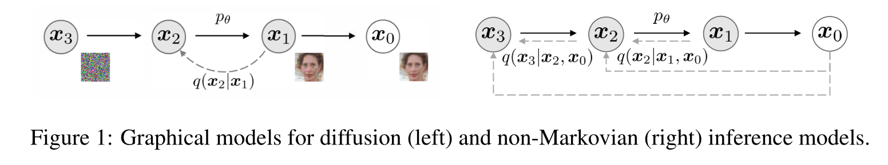
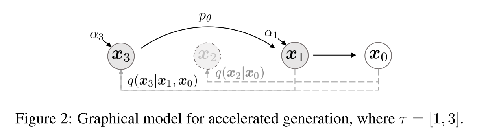
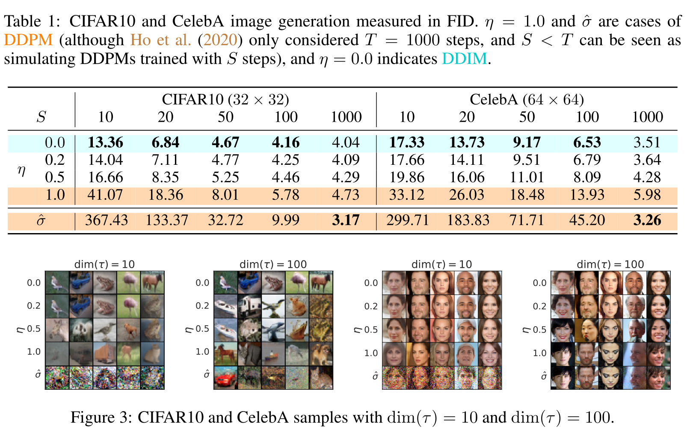
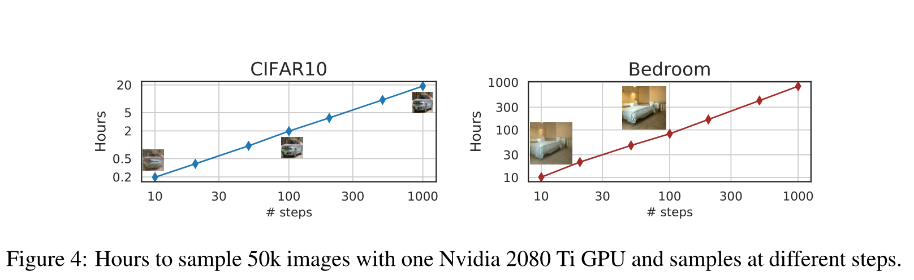

# DENOISING DIFFUSION IMPLICIT MODELS(去噪扩散隐式模型 )

## Abstract

​	去噪扩散概率模型（DDPM）在没有对抗性训练的情况下实现了高质量的图像生成，但它们需要模拟多个步骤的马尔可夫链才能生成样本。为了加速采样，我们提出了去噪扩散隐式模型（DDIMs），这是一种更有效的迭代隐式概率模型，其训练过程与DDPMs相同。在DDPMs中，生成过程被定义为特定马尔可夫扩散过程的逆过程。我们通过一类导致相同训练目标的非马尔可夫扩散过程来推广DDPM。这些非马尔可夫过程可以对应于确定性的生成过程，从而产生更快生成高质量样本的隐式模型。我们的经验证明，与DDPM相比，DDIMS可以产生高质量的样本，在时间上比DDPM快10倍到50倍，允许我们权衡样本质量的计算，直接在潜在空间中执行语义有意义的图像插值，并以非常低的误差重建观测值。

## 1.Introduction

​	深度生成模型已证明能够在许多领域产生高质量样本（Karras等人，2020；van den  Oord等人，2016a）。在图像生成方面，生成对抗网络（GANs，Goodfellow等人（2014））目前显示出比基于似然的方法更高的样本质量，如变分自动编码器（Kingma&Welling，2013）、自回归模型（van  den  Oord等人，2016b）和归一化流（Rezende&Mohamed，2015；Dinh等人，2016）。然而，GAN需要在优化和架构方面进行非常具体的选择，以稳定训练（Arjovsky等人，2017；Gullajani等人，2017年；Karras等人，2018年；Brock等人，2018），并且可能无法涵盖数据分布的模式（Zhao等人，2018）。 

​	最近关于迭代生成模型（Bengio等人，2014年）的工作，如去噪扩散概率模型（DDPM，Ho等人（2020））和噪声条件得分网络（NCSN，Song&Ermon（2019））证明了在不必执行对抗性训练的情况下产生与GANs相当的样本的能力。为了实现这一点，许多去噪自动编码模型被训练以去噪被不同级别的高斯噪声破坏的样本。然后，样本由马尔可夫链生成，马尔可夫链从白噪声开始，逐渐将其去噪为图像。这种生成马尔可夫链过程要么基于Langevin  dynamics（Song&Ermon，2019），要么通过逆转将图像逐渐变为噪声的前向扩散过程而获得（Sohl-Dickstein等人，2015）。

​	这些模型的一个关键缺点是，它们需要多次迭代才能生成高质量的样本。对于DDPM，这是因为生成过程（从噪声到数据）近似于正向扩散过程（从数据到噪声）的反向，这可能有数千个步骤；需要迭代所有步骤来生成单个样本，这比GANs慢得多，GANs只需要一次通过网络。例如，从DDPM采集大小为32×32的50k图像需要大约20小时，但从Nvidia  2080 Ti  GPU上的GAN采集不到一分钟。对于更大的图像，这会变得更加困难，因为在同一个GPU上对大小为256×256的50k图像进行采样可能需要近1000小时。 

​	为了缩小DDPM和GANs之间的效率差距，我们提出了去噪扩散隐式模型（DDIMs）。DDIMs是隐式概率模型（Mohamed&Lakshminarayanan，2016），与DDPM密切相关，因为它们使用相同的目标函数进行训练。 

​	在第3节中，我们将DDPMs使用的前向扩散过程（即马尔可夫过程）推广到非马尔可夫过程，我们仍然能够为其设计合适的逆生成马尔可夫链。我们证明，生成的变分训练目标具有共享的替代目标，这正是用于训练DDPM的目标。因此，我们可以通过选择不同的非马尔可夫扩散过程（第4.1节）和相应的反向生成马尔可夫链，使用相同的神经网络从一大类生成模型中自由选择。特别是，我们能够使用非马尔可夫扩散过程，这导致“短”生成马尔可夫链（第4.2节），可以在少量步骤中进行模拟。这可以仅以样本质量的较小成本大幅提高样本效率。 

​	在第5节中，我们展示了DDMS相对于DDPM的几个经验优势。首先，我们使用我们提出的方法将采样速度加快10倍到100倍，与DDPM相比，DDIMs具有更好的采样生成质量。第二，DDIMs样本具有以下“一致性”属性，这对DDPMs不适用：如果我们从相同的初始潜在变量开始，并生成具有不同长度的马尔可夫链的多个样本，这些样本将具有类似的高级特征。第三，由于DDIMS的“一致性”，我们可以通过操纵DDIMS中的初始潜变量来执行语义上有意义的图像插值，这与DDPM不同，DDPM由于随机生成过程而在图像空间附近进行插值。 

## 2.Background

​	给定数据分布$q(x_0)$的样本，我们关注学习近似于$q(x_0)$且易于采样的模型分布$p_\theta(x_0)$。去噪扩散概率模型(DDPMs，Sohl-Dickstein等人(2015)；Ho等人(2020)）是以下形式的潜在变量模型：
$$
p_\theta(x_0)=\int p_\theta(x_{0:T})dx_{1:T},\quad 其中\quad p_\theta(x_{0:T}):=p_\theta(x_T)\prod_{t=1}^Tp_{\theta}^{(t)}(x_{t-1}|x_t)\qquad(1)
$$
​	其中$x_1,...x_T$是与$x_0$（表示为$\chi$）相同样本空间中的潜在变量。通过最大化变分==下界==（论文里写的是下界，我认为应该是笔误，这里要最大化变分上界），学习参数$\theta$以拟合数据分布$q(x_0)$：
$$
\max_\theta E_{q(x_0)}[\log p_\theta(x_0)]\leq \max_\theta E_{q(x_0,x_1,...,x_T)}[\log p_\theta(x_{0:T})-\log q(x_{1:T}|x_0)]\qquad(2)
$$
​	其中$q(x_{1:T}|x_0)$是潜在变量上的某种推理分布。与典型的潜在变量模型（如变分自动编码器（Rezende等人，2014））不同，DDPM是用固定（而非可训练）推理（感觉这里应该是扩散过程）过程$q(x_{1:T}|x_0)$学习的，潜在变量是相对高维的。例如，Ho等人（2020）考虑了以下具有高斯变换的马尔科夫链，其由递减序列$\alpha_{1:T}\in(0,1]^T$参数化:
$$
q(x_{1:T}|x_0):=\prod_{t=1}^Tq(x_t|x_{t-1})\quad其中\quad q(x_t|x_{t-1}):={\cal N}\Bigg(\sqrt{\frac{\alpha_t}{\alpha_{t-1}}}x_{t-1},\Big(1-\frac{\alpha_t}{\alpha_{t-1}}\Big)\pmb{I}\Bigg)\qquad(3)
$$
​	其中必须确保协方差矩阵（对角线上的元素为各个随机变量的方差，非对角线上的元素为两两随机变量之间的协方差）在其对角线上具有正项。由于采样过程（从$x_0$到$x_T$）的自回归性质，这被称为正向过程。我们将潜在变量模型$p_\theta(x_{0:T})$称为生成过程，因为它近似于难以处理的反向过程$q(x_{t-1}|x_t)$。直观的说，正向过程逐渐将噪声添加到观测$x_0$，而生成过程逐渐消除噪声观测（图1左图）。

​	正向过程的一个特殊特性是： 
$$
q(x_t|x_0):=\int q(x_{1:t}|x_0)dx_{1:(t-1)}={\cal N}(x_t;\sqrt{\alpha_t}x_0,(1-\alpha_t)\pmb{I});
$$
​	因此，我们可以将$x_t$表示为$x_0$和噪声变量$\epsilon$的线性组合：
$$
x_t=\sqrt{\alpha_t}x_0+\sqrt{1-\alpha_t}\epsilon,\quad其中\quad\epsilon\sim {\cal N}(\pmb 0, \pmb I)\qquad(4)
$$
​	当我们将$\alpha_T$设置为足够接近0时，对于所有$x_0$，$q(x_T|x_0)$收敛到标准高斯，因此自然设置$p_\theta(x_T):={\cal N}(\pmb 0, \pmb I)$。如果将所有条件建模为具有可训练均值函数和固定方差的高斯函数，则等式(2)中的目标可以简化为：
$$
L_\gamma(\epsilon_\theta):=\sum_{t=1}^T\gamma_tE_{x_0\sim q(x_0),\epsilon_t\sim {\cal N}(\pmb 0,\pmb I)}[||\epsilon_\theta ^{(t)}(\sqrt{\alpha_t}x_0+\sqrt{1-\alpha_t }\epsilon_t)-\epsilon_t||^2_2]\qquad(5)
$$
​	其中$\epsilon_\theta:=\{\epsilon_\theta ^{(t)} \}_{t=1}^T$是一组$T$函数，每个$\epsilon_\theta ^{(t)}:\chi\rightarrow\chi$（由$t$索引）是具有可训练参数$\theta^{(t)}$的函数，$\gamma:=[\gamma_1,...,\gamma_T]$ 是目标中依赖于$\alpha_{1:T}$的正系数向量。在Ho等人（2020）中，$\gamma=1$的目标被优化，以最大化训练模型的生成能力；这也是基于分数匹配（Hyvärinen,2005;Vincent,2011）的噪声条件分数网络（Song&Ermon,2019）中使用的相同目标。从训练模型中，首先从先验$p_\theta(x_T)$中采样$x_T$，然后从生成过程中迭代采样$x_{t-1}$，最后得到$x_0$。

​	正向过程的长度$T$是DDPMs中的一个重要超参数。从变分的角度来看，较大的$T$允许反向过程接近高斯（Sohl-Dickstein等人，2015），因此用高斯条件分布建模的生成过程是一个很好的近似值；这促使人们选择大的$T$值，如Ho等人（2020）中的$T=1000$。然而，由于所有$T$次迭代都必须顺序执行，而不是并行执行，以获得样本$x_0$，因此，从DDPM进行的采样要比从其他深度生成模型进行的采样慢得多，这使得它们对于计算有限且延迟非常关键的任务来说不切实际。

## 3.VARIATIONAL INFERENCE FOR NON-MARKOVIAN FORWARD PROCESSES(非马尔科夫正向过程的变分推理)

​	由于生成模型近似于==推理过程的反向过程==(近似于DDPM扩散过程的反向过程），我们需要重新思考推理过程，以减少生成模型所需要的迭代次数。我们的主要发现是，$L_\gamma$形式的DDPM目标仅取决于边缘分布$q(x_t|x_0)$，而不取决于联合分布$q(x_{1:T}|x_0)$。由于存在许多具有相同边缘分布的推理分布（联合分布），我们探索了非马尔科夫的替代推理过程，这导致了新的生成过程（图1，右侧）。这些非马尔可夫推理过程导致与DDPM相同的代理目标函数，如下所示。在附录A中，我们证明了非马尔科夫视角也适用于高斯情形以外的情形。

### 3.1 NON-MARKOVIAN FORWARD PROCESSES（非马尔科夫链的前向过程）

​	让我们考虑一个由实数向量$\sigma \in \R_{\geq 0}^T$索引的推理分布族$\cal Q$:
$$
q_\sigma(x_{1:T}|x_0):=q_\sigma(x_T|x_0)\prod_{t=2}^Tq_\sigma(x_{t-1}|x_t,x_0)\qquad(6)
$$
​	其中$q_\sigma(x_T|x_0)={\cal N}(\sqrt{\alpha_T}x_0,(1-\alpha_T)\pmb I)$，并且所有$t>1$，
$$
q_\sigma(x_{t-1}|x_t,x_0)={\cal N}(\sqrt{\alpha_t-1}x_0+\sqrt{1-\alpha_{t-1}-\sigma_t^2}\cdot\frac{x_t-\sqrt{\alpha_t}x_0}{\sqrt{1-\alpha_t}},\sigma_t^2\pmb I)\qquad(7)
$$
​	选择平均函数以确保$q_\sigma(x_t|x_0)={\cal N}(\sqrt{\alpha_t}x_0,(1-\alpha_t)\pmb I)$对于所有$t$​都成立，以便于定义与所需“边缘分布”匹配的联合推理分布。前向过程可以从贝叶斯规则导出：
$$
q_\sigma(x_t|x_{t-1},x_0)=\frac{q_\sigma(x_{t-1}|x_t,x_0)q_\sigma(x_t|x_0)}{q_\sigma(x_{t-1}|x_0)},\qquad(8)
$$
​	这也是高斯的（尽管我们在本文的其余部分不使用这一事实）。与等式(3)中的扩散过程不同，这里的正向过程不再是马尔可夫过程，因为==每个$x_t$可能同时依赖于$x_{t-1}$和$x_0$==。$\sigma$的大小控制正向过程的随机性：当$\sigma\rightarrow \pmb0$，我们达到了一个极端情况，只要我们观察$x_0$和$x_t$的某个$t$，那么$x_{t-1}$就变得已知和固定。

### 3.2 GENERATIVE PROCESS AND UNIFIED VARIATIONAL INFERENCE OBJECTIVE（生成过程与统一变分推理目标）

​	接下来，我们定义了一个可训练的生成过程$p_\theta(x_{0:T})$，其中每个$p_\theta^{(t)}(x_{t-1}|x_t)$利用$q_\sigma(x_{t-1}|x_t,x_0)$的知识。直观地说，给定一个噪声观测$x_t$，我们首先对相应的$x_0$进行观测，然后使用它通过反向条件分布$q_\sigma(x_{t-1}|x_t,x_0)$来获得样本$x_{t-1}$，这是我们已经定义的。

​	对于某些$x_0\sim q(x_0)$和$\epsilon_t\sim {\cal N}(\pmb0, \pmb I)$,$x_t$可以由方程(4)获得。然后模型$\epsilon_\theta ^{(t)}(x_t)$尝试在不知道$x_0$的信息的情况下从$x_t$预测$\epsilon_t$。

通过重写方程(4)，就可以预测去噪观测，这是给定$x_t$的$x_0$预测：
$$
 f_\theta ^{(t)}(x_t):=(x_t-\sqrt{1-\alpha_t}\cdot\epsilon_\theta^{(t)}(x_t))/\sqrt{\alpha_t}\qquad(9)
$$
​	我们可以定义具有固定先验$p_\theta(x_T)={\cal N}(\pmb0, \pmb I)$的生成过程，并且
$$
p_\theta^{(t)}(x_{t-1}|x_t)=\begin{cases}{\cal N}(f_\theta^{(1)}(x_1),\sigma_1^2\pmb I)\qquad if\:\:t=1, \\q_\sigma(x_{t-1}|x_t,f_\theta^{(t)}(x_t))\qquad 其他,\end{cases}\qquad(10)
$$
​	其中$q_\sigma(x_{t-1}|x_t,f_\theta^{(t)}(x_t))$是根据方程(7)通过将$x_0$替换为$f_\theta^{(t)}(x_t)$定义的。我们在$t=1$的情况下添加一些高斯噪声（协方差为$\sigma_1^2\pmb I$），以确保生成过程在任何地方都能得到支持。

​	我们通过以下变分推理目标优化$\theta$（它是$\epsilon_\theta$​上的函数）：
$$
J_\sigma(\epsilon_\theta):=\mathbb{E}_{x_{0:T}\sim q_\sigma(x_{0:T})}\Big[\log q_\sigma(x_{1:T}|x_0)-\log p_\theta(x_{0:T})\Big]\qquad\qquad\qquad\qquad\qquad\qquad\qquad\qquad\qquad\qquad\qquad\qquad\qquad\\=\mathbb{E}_{x_{0:T}\sim q_\sigma(x_{0:T})}\Bigg[\log q_\sigma(x_T|x_0)+\sum_{t=2}^{T}\log q_\sigma(x_{t-1}|x_t,x_0)-\sum_{t=1}^T\log p_\theta^{(t)}(x_{t-1}|x_t)-\log p_\theta(x_T)\Bigg]\qquad(11)
$$
​	其中，我们根据等式(6)分解$q_\sigma(x_{1:T}|x_0)$，根据等式(1)分解$p_\theta(x_{0:T})$。

​	从$J_\sigma$的定义来看，似乎必须为$\sigma$的每个选择训练不同的模型，因为它对应于不同的变分目标和不同的生成过程。然而对于某些权重$\gamma$，$J_\sigma$等于$L_\gamma$​，如下所示。
$$
\pmb{定理1.}对于所有\sigma>0，存在\gamma\in\R_{>0}^T和C\in\R，使得J_\sigma=L_\gamma+C
$$
​	变分目标$L_\gamma$是特殊的，因为如果模型$\epsilon_\theta^{(t)}$的参数$\theta$不在不同的$t$之间共享，那么$\epsilon_\theta$的最优解将不依赖于权重$\gamma$（因为通过分别最大化总和中的每个项来实现全局最优）。$L_\gamma$的这个性质由两个含义。一方面，这证明==使用$L_1$作为DDPMs中变分下线的替代目标函数是合理的==；另一方面，==由于$J_\sigma$等价于定理1中的某个$L_\gamma$，因此$J_\sigma$的最优解也与$L_1$的最优解相同==。因此，如果模型$\epsilon_\theta$中的参数在$t$之间不共享，那么Ho等人（2020）使用的$L_1$目标也可以用作变分目标$J_\sigma$的替代目标。

## 4.SAMPLING FROM GENERALIZED GENERATIVE PROCESSES（广义生成过程的抽样）

​	以$L_1$为目标，我们不仅学习了Sohl-Dickstein等人（2015）和Ho等人（2020）中考虑的马尔可夫推理过程的生成过程，还学习了我们所描述的由$\sigma$参数化的许多非马尔科夫正向过程的生成过程。因此，我们基本上使用预训练的DDPM模型作为新目标的解决方案，并通过改变$\sigma$，专注于寻找一个更适合于根据我们的需要生成样本的生成过程。

### 4.1 DENOISING DIFFUSION IMPLICIT MODELS（去噪扩散隐式模型）

​	根据等式(10)中的$p_\theta(x_{1:T})$，可以根据样本$x_t$生成样本$x_{t-1}$:
$$
x_{t-1}=\sqrt{\alpha_t-1}\Bigg(\underbrace{\frac{x_t-\sqrt{1-\alpha_t}\epsilon_\theta^{(t)}(x_t)}{\sqrt{\alpha_t}}}_{^"预测x_0^"} \Bigg)+\underbrace{\sqrt{1-\alpha_{t-1}-\sigma_t^2}\cdot\epsilon_\theta^{(t)}(x_t)}_{^"指向x_t的方向^"}+\underbrace{\sigma_t\epsilon_t}_{随机噪声}\qquad(12)
$$
​	其中$\epsilon_t\sim {\cal N}(\pmb0,\pmb I)$是与$x_t$无关的标准高斯噪声，我们定义$\alpha_0:=1$。==即使使用相同的模型$\epsilon_\theta$，$\sigma$值的不同选择也会导致不同的生成过程，因此，重新训练模型是不必要的。==

​	对于所有的$t$，当$\sigma_t=\sqrt{(1-\alpha_{t-1})/(1-\alpha_t)}\sqrt{1-\alpha_t/\alpha_{t-1}}$，正向过程变为马尔科夫过程，生成过程变为DDPM。

​	我们注意到另一种特殊情况，==当对于所有的$t$，$\sigma_t=0$时；在给定$x_{t-1}$和$x_0$时，正向过程变为确定性过程，但当$t=1$时除外；在生成过程中，随机噪声之前的系数$\epsilon_t$变为0。所得模型为隐式概率模型（Mohamed&Lakshminarayanan，2016），其中样本是通过固定程序（从$x_T$到$x_0$）从潜在变量生成的==。我们将其命名为去噪扩散隐式模型（DDIM），因为他是一种以DDPM为目标训练的隐式概率模型（尽管正向过程不再是扩散）。

### 4.2 ACCELERATED GENERATION PROCESSES（加速生成过程）

​	在前面的章节中，生成过程被视为反向过程的近似；由于正向过程有$T$个步骤，生成过程也被迫采样$T$个步骤。然而，由于只要$q_\sigma(x_t|x_0)$是固定的，去噪目标$L_1$就不依赖于特定的正向过程，我们也可以考虑小于$T$的正向过程。这可以加速相应的生成过程，而无需训练不同的模型。

​	让我们考虑不是在所有潜在变量$x_{1:T}$上定义，而是在其子集$\{x_{{\cal T}_1},...,x_{{\cal T}_s}\}$上定义的的正向过程，其中$\cal T$是长度为$\cal S$的的递增子序列$[1,...,T]$。特别是，我们定义了在$x_{{\cal T}_1},...,x_{{\cal T}_s}$上的顺序正向过程，使得$q(x_{\cal T_i}|x_0)={\cal N}(\sqrt{\alpha_{\cal T_i}}x_0,(1-\alpha_{\cal  T_i})\pmb I)$与“边缘分布”匹配（见图2）。生成过程现在根据反向过程$(\cal T)$对潜在变量进行采样，我们称之为（采样）轨迹。当采样轨迹的长度小于$T$时，由于采样过程的迭代性质，我们可以显著提高计算效率。

​	使用与第3节中类似的参数，我们可以证明使用$L_1$目标训练的模型是合理的，因此在训练中不需要改变。我们表明，仅需对等式(12)中的更新进行轻微修改，即可获得新的、更快的生成过程，这适用于DDPM、DDIM以及等式(10)中考虑的所有生成过程。我们在附录C.1中包含了这些细节。

​	原则上，这意味着我们可以训练具有任意数量的正向步骤的模型，但在生成过程中只能从其中的一些步骤中采样。因此，经过训练的模型可以考虑比（Ho等人，2020）中考虑的步骤更多的步骤，甚至可以考虑连续时间变量t（Chen等人，2020）。我们把这方面的实证研究留给未来的工作。

### 4.3 RELEVANCE TO NEURAL ODES（与神经常微分方程的相关性）

​	此外，我们可以根据等式(12)重写DDIM迭代，令其与求解常微分方程（ODEs）的欧拉积分的相似性变得更加明显：

​	注：这里因为是选择了较短的采样轨迹，因此用$t-\Delta t$将$t-1$代换掉了。将等式(12)左右同除$\sqrt{\alpha_{t-\Delta t}}$就得到了等式(13)。
$$
\frac{x_{t-\Delta t}}{\sqrt{\alpha_{t-\Delta t}}}=\frac{x_t}{\sqrt{\alpha_t}}+\Bigg(\sqrt{\frac{1-\alpha_{t-\Delta t}}{\alpha_{t-\Delta t}}}-\sqrt{\frac{1-\alpha_t}{\alpha_t}} \Bigg)\epsilon_\theta^{(t)}(x_t)\qquad(13)
$$
​	为了导出相应的ODE，我们可以用$\sigma$来重新参数化$(\sqrt{1-\alpha}/\sqrt{\alpha})$，用$\overline{x}$来重新参数化$(x/\sqrt{\alpha})$。在连续的情况下，$\sigma$和$x$是关于$t$的函数，其中$\sigma:\R_{\geq0}\rightarrow\R_{\geq0}$是连续的，随着$\sigma(0)=0$而增加。方程(13)可以被视为以下ODE上的欧拉方法：
$$
d\overline{x}(t)=\epsilon_\theta^{(t)}\Bigg(\frac{\overline{x}(t)}{\sqrt{\sigma^2+1}} \Bigg)d\sigma(t)\qquad(14)
$$
​	其中，对于非常大的$\sigma(T)$（对应于$\alpha\approx0$），初始条件为$x(T)\sim{\cal N}(0,\sigma(T))$。这表明，通过足够的离散化步骤，我们还可以反转生成过程（从$t=0$到$t$），将$x_0$编码为$x_T$，并模拟等式(14)中的ODE的反转。这表明，与DDPM不同，我们可以使用DDIM来获得观测值的编码（以$x_T$的形式），这对于需要模型潜在表示的其他下游应用可能有用。

​	注：等式(13)----等式(14)的推导过程如下：

​		首先对(13)进行移项：
$$
\frac{x_t}{\sqrt{\alpha_t}}-\frac{x_{t-\Delta t}}{\sqrt{\alpha_{t-\Delta t}}}=\Bigg(\sqrt{\frac{1-\alpha_t}{\alpha_t}}-\sqrt{\frac{1-\alpha_{t-\Delta t}}{\alpha_{t-\Delta t}}} \Bigg)\epsilon_\theta^{(t)}(x_t)
$$
​		用$\sigma$来重新参数化$(\sqrt{1-\alpha}/\sqrt{\alpha})$，用$\overline{x}$来重新参数化$(x/\sqrt{\alpha})$：
$$
\overline{x}_t-\overline{x}_{t-\Delta t}=(\sigma_t-\sigma_{t-\Delta t})\epsilon_\theta^{(t)}(x_t)
$$
​		取极限：
$$
\lim{\frac{\overline{x}_t-\overline{x}_{t-\Delta t}}{\Delta t}}=\lim{\frac{\sigma_t-\sigma_{t-\Delta t}}{\Delta t}}\epsilon_\theta^{(t)}(x_t)\\
d\overline{x}(t)=\epsilon_\theta^{(t)}(x_t)d\sigma(t)
$$
​		这里只剩$x_t$需要代换了：	
$$
\sigma=\sqrt{1-\alpha}/\sqrt{\alpha}\rightarrow\alpha=\frac{1}{\sigma^2+1}\rightarrow x(t)=\overline{x}\cdot \alpha=\frac{\overline{x}(t)}{\sqrt{\sigma^2+1}}
$$
​		推导结束。

​	在一项concurrent work中，（Song等人，2020年）提出了一种“probability flow ODE”，旨在基于分数恢复随机微分方程（SDE）的边缘密度，从中可以获得类似的采样计划。这里，我们声明我们的ODE等价于他们的一个特例（对应于DDPM的连续时间模拟）。 

​	**Proposition 1.**等式(14)中具有最优模型$\epsilon_\theta^{(t)}$的ODE有一个和（Song等人，2020年）提出的“Variance-Exploding”SDE（方差爆炸SDE）等效的probability flow ODE。

​	我们在附录B中提供了证明。虽然ODE是等效的，但采样程序不是等效的，因为概率流ODE的欧拉方法将进行以下更新： 
$$
\frac{x_{t-\Delta t}}{\sqrt{\alpha_{t-\Delta t}}}=\frac{x_t}{\sqrt{\alpha_t}}+\frac{1}{2}\Bigg(\frac{1-\alpha_{t-\Delta t}}{\alpha_{t-\Delta t}}-\frac{1-\alpha_t}{\alpha_t}\ \Bigg)\cdot\sqrt{\frac{\alpha_t}{1-\alpha_t}}\cdot\epsilon_\theta^{(t)}(x_t)\qquad(15)
$$
​	这相当于我们的$\alpha_t$和$\alpha_{t-\Delta t}$足够接近。然而，在较少的采样步骤中，这些选择将产生差异；我们对$d\sigma(t)$采取欧拉步骤（其不太直接依赖于“时间”$t$的缩放），而Song等人（2020）对$dt$采取欧拉步骤。

## 5. EXPERIMENTS

​	在本节中，我们表明，当考虑较少的迭代时，DDIMS在图像生成方面优于DDPMs，与原始DDPM生成过程相比，速度提高了10倍到100倍。此外，与DDPMs不同，一旦初始潜在变量$x_T$固定，DDIMs保留高级图像特征，而与生成轨迹无关，因此它们能够直接从潜在空间执行插值。DDIMS还可用于编码样本，从潜在代码中重构样本，由于随机采样过程，DDPMs无法做到这一点。 

​	对于每个数据集，==我们使用相同的训练模型==，$T=1000$，目标为来自等式(5)的$L_\gamma$，其中$\gamma=1$；如我们在第3节中所述，训练过程无需更改。我们所做的唯一改变是如何从模型中生成样本；我们通过控制τ（控制获得样本的速度）和σ（在确定性DDM和随机DDPM之间插值）来实现这一点。

​	我们考虑$[1,...,\cal T]$的不同的子序列$\cal T$和由$\cal T$元素索引的不同方差的超参数$\sigma$。为了简化比较，我们考虑$\sigma$的形式为：
$$
\sigma_{\cal T_i}(\eta)=\eta\sqrt{(1-\alpha_{\cal T_{i-1}})/(1-\alpha_{\cal T_i})}\sqrt{1-\alpha_{\cal T_i}/\alpha_{\cal T_{i-1}}}\qquad(16)
$$
​	其中$\eta\in\R_{\geq0}$是我们可以直接控制的超参数。这包括$\eta=1$时的原始DDPM生成过程和$\eta=0$时的DDIM。我们还考虑了DDPM，其中随机噪声的标准偏差大于$\sigma(1)$，我们将其表示为$\hat{\sigma}:\hat{\sigma}_{\cal T_i}=\sqrt{1-\alpha_{\cal T_i}/\alpha_{\cal T_{i-1}}}$。Ho等人（2020）中的实现仅用于获取CIFAR10样本，而不是其他数据集的样本。我们在附录D中包含更多详细信息。 

### 5.1 SAMPLE QUALITY AND EFFICIENCY

​	在表1中，我们报告了使用在CIFAR10和CelebA上训练的模型的生成样本的质量，我们的结果通过Frechet Inception Distance (FID (Heusel et al., 2017))测量， 其中我们改变了用于生成样本的时间步长（$dim(\cal T)$）和过程的随机性（$\eta$）。正如预期的那样，随着$dim(\cal T)$的增加，样本质量变得更高，从而在样本质量和计算成本之间进行权衡。我们观察到，当$dim(\cal T)$较小时，DDIM($\eta=0$)实现了最佳的样本质量，与具有相同$dim(\cal T)$的较少随机对应物相比，除了Ho等人（2020年）报告的$dim(\cal T)=1000$和$\hat{\sigma}$的情况下DDIM稍差以外，DDPM($\eta=1$和$\hat{\sigma}$)通常具有更差的样本质量。 然而，对于较小的$dim(\cal T)$，$\hat{\sigma}$的样本质量变得更差，这表明它不适合于较短的轨迹。另一方面，DDIM更一致地实现了较高的样本质量。

​	在图3中，我们显示了具有相同采样步数和不同$\sigma$的CIFAR10和CelebA样本。对于DDPM，当采样轨迹具有10个步长时，样本质量迅速恶化。对于$\hat{\sigma}$的情况，生成的图像在短轨迹下似乎具有更多的噪声扰动；这解释了为什么FID分数比其他方法差得多，因为FID对此类扰动非常敏感（如Joliceur  Martineau等人（2020年）所述）。 

​	在图4中，我们显示了产生样本所需的时间量与样本轨迹的长度成线性比例。这表明DDIM有助于更有效地生成样本，因为样本可以在更少的步骤中生成。值得注意的是，DDIM能够在20到100个步骤内生成质量与1000个步骤模型相当的样本，与原始DDPM相比，速度提高了10到50倍。即使DDPM也可以通过100×步骤实现合理的样本质量，但DDIM需要的步骤要少得多；在CelebA上，100步DDPM的FID分数与20步DDIM的相似。 

### 5.2 SAMPLE CONSISTENCY IN DDIMS(DDIMs中的样本一致性)

​	对于DDIM，生成过程是确定性的，$x_0$仅取决于初始状态$x_T$。在图5中，我们观察了不同生成轨迹（即不同$\cal T$）下生成的图像，同时从相同的初始$x_T$开始。有趣的是，对于具有相同初始$x_T$的生成图像，无论生成轨迹如何，大多数高级特征都是相似的。在许多情况下，仅使用20个步骤生成的样本在高级特征方面已经非常类似于使用1000个步骤生成生成的样本，只是在细节上存在细微差异。因此，==看起来$x_T$单独将属于图像的信息潜在编码；并且影响样本质量的次要细节被编码在参数中，因为较长的样本轨迹提供了更好的样本质量，但不会显著影响高级特征。==我们在附录D.4中展示了更多样本。 

​	由于DDIM样本的高级特征由$x_T$编码，我们想了解它是否会表现出类似于其他隐式概率模型（如GANs）中观察到的语义插值效应（Goodfello等人，2014）。这与Ho等人（2020）中的插值过程不同，因为在DDPM中，由于随机生成过程，相同的$x_T$会导致高度不同的$x_0$。在图6中，我们表明，==$x_T$中的简单插值可以产生两个样本之间语义有意义的插值==。我们在附录D.5中包含了更多细节和样本。==这允许DDIM直接通过潜在变量在高水平上控制生成的图像，而DDPMs无法做到这一点。==

### 5.4 RECONSTRUCTION FROM LATENT SPACE（从潜在空间重建）

​	由于DDIM是特定ODE的欧拉积分，因此很有意思的是看它是否可以从$x_0$编码到$x_T$（与等式(14)相反），并从得到的$x_T$（等式(14)）重构$x_0$。我们考虑在CIFAR-10测试集上进行编码和解码，使用CIFAR-20模型，编码和解码均采用S步；我们在表2中报告了每维均方误差（缩放到[0,1]）。我们的结果表明，对于较大的$S$值，DDIMs具有较低的重建误差，并且具有类似于Neural ODEs（神经常微分方程）和normalizing flows（归一化流模型）的特性。由于DDPMs具有随机性，因此不能对其进行同样的分析。 

## 6.  RELATED WORK

​	我们的工作基于一大系列现有方法，这些方法将生成模型学习为马尔科夫链的转移算子（Sohl-Dickstein等人，2015；Bengio等人，2014；Salimans等人，2014年；Song等人，2017年；Goyal等人，2017；Levy等人，2017）。其中，==去噪扩散概率模型（DDPMs，Ho等人（2020））和噪声条件得分网络（NCSN，Song&Ermon（2019；2020））最近实现了与GANs相当的高样本质量（Brock等人，2018；Karras等人，2018）==。DDPMs优化了对数似然的变分下限，而NCSN优化了数据的非参数Parzen密度估计（Vincent，2011；Raphan&Simoncelli，2011）的得分匹配目标（Hyvärinen，2005）。 

​	尽管动机不同，但DDPM和NCSN密切相关。两种方法都对许多噪声级使用去噪自动编码器目标，并且都使用类似于Langevin  dynamics的过程来产生样本（Neal等人，2011）。由于Langevin  dynamics是梯度流的离散化（Jordan等人，1998年），DDPM和NCSN都需要许多步骤来实现良好的样本质量。这与DDPM和现有NCSN方法在几次迭代中难以生成高质量样本的观察结果一致。 

​	另一方面，DDIM是一种隐式生成模型（Mohamed&Lakshminarayanan，2016），其中样本由潜在变量唯一确定。因此，DDIM具有类似于GANs（Goodfello等人，2014）和invertible flows（可逆流模型）（Dinh等人，2016）的某些属性，例如产生语义有意义的插值的能力。我们从纯变分的角度推导出DDIM，其中Langevin动力学的限制是不相关的；这可以部分解释为什么我们能够在较少的迭代下观察到优于DDPM的样本质量。DDIM的采样过程也让人想起具有连续深度的神经网络（Chen等人，2018；Grathwohl等人，2018），因为它从同一潜在变量产生的样本具有类似的高级视觉特征，而不管具体的样本轨迹如何。 

## 7.  DISCUSSION

​	我们从纯变分的角度提出了DDIMs—一种以去噪自动编码/分数匹配目标为训练目标的隐式生成模型。DDIM能够比现有的DDPMs和NCSNs更有效地生成高质量样本，并能够从潜在空间执行有意义的插值。这里提出的非马尔科夫正向过程似乎暗示了高斯以外的连续正向过程（这在原始扩散框架中无法实现，因为高斯是唯一具有有限方差的稳定分布）。在附录a中，我们还演示了一个具有多项式正向过程的离散情况，研究其他组合结构的类似替代方案将很有趣。 

​	此外，由于直接数据模型的采样过程类似于neural ODE（神经常微分方程）的采样过程，因此，我们关心这些减少ODEs（常微分方程）离散化误差的方法，包括Adams-Bashforth（Adams  Bashfth）（Butcher&Goodwin，2008）等多步方法是否有助于在更少的步骤中进一步提高样本质量（Queiruga等人，2020年）。研究DDIMs是否表现出现有隐式模型的其他特性也是相关的（Bau等人，2019）。 