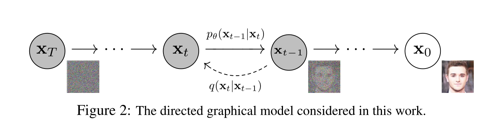
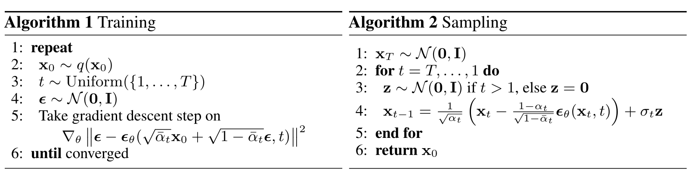
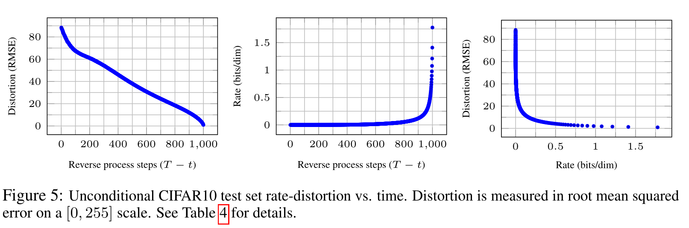

# Denoising Diffusion Probabilistic Models（去噪扩散概率模型）

## Abstract

​	我们使用扩散概率模型（一类受非平衡热力学影响的潜在变量模型）提供高质量的图像合成结果。我们的最佳结果是通过在加权变分边界上进行训练获得的，该边界是根据扩散概率模型与Langevin  dynamics去噪分数匹配之间的新联系设计的，我们的模型自然允许渐进有损解压方案，该方案可以解释为自回归解码的推广。在无条件CIFAR10数据集上，我们获得了9.46的初始分数和3.17的最新FID分数。在256x256  LSUN上，我们得到了与ProgressiveGAN相似的样本质量。我们的实施方案可在https://github.com/hojonathanho/diffusion. 

## 1. Introduction

​	各种深度生成模型最近在各种数据模式中展示了高质量样本。生成对抗网络（GANs）、自回归模型、FLOW和变分自动编码器（VAE）合成了引人注目的图像和音频样本[14,27,3,58,38,25,10,32,44,57,26,33,45]，基于能量的建模和分数匹配也取得了显著进展，产生了与GANs类似的图像[11,55]。 

​	本文介绍了扩散概率模型的进展[53]。扩散概率模型（为简洁起见，我们将其称为“扩散模型”）是一个参数化马尔可夫链，使用变分推理进行训练，以在有限时间后生成与数据匹配的样本。学习该链的转变以反转扩散过程，该扩散过程是一个马尔可夫链，在采样的相反方向上逐渐向数据添加噪声，直到信号被破坏。当扩散包含少量高斯噪声时，将采样链转换也设置为条件高斯就足够了，从而允许特别简单的神经网络参数化。 

​	扩散模型定义简单，训练效率高，但据我们所知，尚未证明它们能够生成高质量样本。我们发现，扩散模型实际上能够生成高质量的样本，有时比其他类型生成模型的公布结果更好（第4节）。此外，我们还发现，扩散模型的某些参数化揭示了在训练过程中与多个噪声水平上的去噪分数匹配以及在采样过程中与退火Langevin动力学的等价性（第3.2节）[55,61]。我们使用此参数化获得了最佳样本质量结果（第4.2节），因此我们认为此等价性是我们的主要贡献之一。 

​	尽管样本质量很高，但与其他基于似然的模型相比，我们的模型没有竞争性的对数似然度（然而，我们的模型的对数似似度确实确实比大估计更好。据报道，退火重要性采样为基于能量的模型和分数匹配生成[11,55]）。我们发现，我们模型的大部分无损码长用于描述不可感知的图像细节（第4.3节）。我们用有损压缩的语言对这一现象进行了更精细的分析，并证明了扩散模型的采样过程是一种渐进解码，类似于自回归解码，沿比特排序，极大地概括了自回归模型通常可能的情况。 

## 2. Background

​	

​	扩散模型[53]的形式为$p_\theta(x_0):=\int p_\theta(x_{1:T})dx_{1:T}$，其中$x_1,...,x_T$是与数据$x_0\sim q(x_0)$具有相同维度的潜在值。联合分布$p_\theta(x_{0:T})$称为反向过程。并且它被定义为从$p(x_T):={\cal N}(x_T;\pmb0;\pmb I)$开始的学习高斯变换的马尔科夫链：
$$
p_\theta(x_{0:T}):=p(x_T)\prod_{t=1}^Tp_\theta(x_{t-1}|x_t),\qquad p_\theta(x_{t-1}|x_t):={\cal N}(x_{t-1};\mu_\theta(x_t,t),\sum_\theta(x_t,t))\qquad(1)
$$
​	扩散模型与其他类型的潜在变量模型的区别在于，被称为前向过程或扩散过程的近似后验$q(X_{1:T}|X_0)$根据方差表$\beta_1,...,\beta_T$被固定到马尔可夫链：
$$
q(x_{1:T}|x_0):=\prod_{t=1}^Tq(x_t|x_{t-1}),\qquad q(x_t|x_{t-1}):={\cal N}(x_t;\sqrt{1-\beta_t}x_{t-1},\beta_t\pmb I)\qquad(2)
$$
​	通过优化负对数似然的通常变分边界来执行训练： 
$$
\mathbb{E}[-\log p_\theta(x_0)]\leq\mathbb{E}_q\Bigg[-\log\frac{p_\theta(x_{0:T})}{q(x_{1:T}|x_0)}\Bigg]=\mathbb{E}_q\Bigg[-\log p(x_T)-\sum_{t\geq1}\log \frac{p_\theta(x|_{t-1}|x_t)}{q(x_t|x_{t-1})}\Bigg]=:L\qquad(3)
$$
​	前向过程方差$\beta_t$可以通过重参数化[33]来学习，或者作为超参数保持为常数，并且反向过程的表达性部分通过选择$p_\theta(x_{t-1}|x_t)$中的高斯条件来保证，因为当$\beta_t$很小时，两个过程具有相同的函数形式[53]。正向过程的一个显著特性是，它允许在任意时间步长$t$以闭合形式对$x_t$进行采样：使用符号$\alpha_t:=1-\beta_t$和$\overline{\alpha}_t:=\prod_{s=1}^t\alpha_s$，我们有：
$$
q(x_t|x_0)={\cal N}(x_t;\sqrt{\overline{\alpha}_t}x_0,(1-\overline{\alpha}_t)\pmb I)\qquad(4)
$$
​	因此，通过使用随机梯度下降优化$L$的随机项，可以进行有效的训练。通过将L(3)重写为： 
$$
\mathbb{E}_q\Bigg[\underbrace{D_{KL}(q(x_T|x_0)||p(x_T))}_{L_T}+\sum_{t>1}\underbrace{D_{KL}(q(x_{t-1}|x_t,w_0)||p_\theta(x_{t-1}|x_t))}_{L_{t-1}}\underbrace{-\log p_\theta(x_0|x_1)}_{L_0}\Bigg]\qquad(5)
$$
​	注：当$t=1$时，$L_{t-1}=L_0$，故后两项可以合并到一起，即$L_{t-1}^{'}=\sum_{t=1}^TD_{KL}(q(x_{t-1}|x_t,w_0)||p_\theta(x_{t-1}|x_t))$

​	（详见附录A。术语上的标签在第3节中使用。）等式(5)使用KL散度直接比较$p_\theta(x_{t-1}|x_t)$与前向过程后验，后者（前向过程后验）在条件$x_0$​给出时是易于处理的：
$$
q(x_{t-1}|x_t,x_0)={\cal N}(x_{t-1};\tilde{\mu}_t(x_t,x_0),\tilde{\beta}_t\pmb I)\qquad(6)\\
其中\quad \tilde{\mu}_t(x_t,x_0):=\frac{\sqrt{\overline{\alpha}_{t-1}}\beta_t}{1-\overline{\alpha}_t}x_0+\frac{\sqrt{\alpha_t}(1-\overline{\alpha}_{t-1})}{1-\overline{\alpha}_t}x_t\quad并且\quad \tilde{\beta}_t:=\frac{1-\overline{\alpha}_{t-1}}{1-\overline{\alpha}_t}\beta_t\qquad(7)
$$
​	因此，等式(5)中的所有KL散度都是高斯分布之间的比较，因此它们可以以Rao-Blackwellized方式计算，使用闭合形式表达式而不是高方差蒙特卡洛估计。

## 3.Diffusion models and denoising autoencoders

​	扩散模型可能看起来是一类有限的潜在变量模型，但它们在实现中允许大量的自由度。必须选择正向过程的方差βt以及反向过程的模型结构和高斯分布参数化。为了指导我们的选择，我们在扩散模型和去噪得分匹配（第3.2节）之间建立了一个新的显式联系，从而为扩散模型建立了一种简化的加权变分边界目标（第3-4节）。最终，我们的模型设计通过简单性和经验结果得到了验证（第4节）。我们的讨论按照等式(5)的术语进行分类。

### 3.1 Reverse process and $L_T$

​	我们忽略了前向过程方差$\beta_t$可通过重新参数化学习的事实，而是将其固定为常数（详见第4节）。因此，在我们的实现中，近似后验$q$没有可学习的参数，因此在训练期间$L_T$是常数，可以忽略。 

### 3.2 Reverse process and $L_{1:T-1}$

​	现在，我们在分布$p_\theta(x_{t-1}|x_t)-{\cal N}(x_{t-1};\mu_\theta(x_t,t),\sum_\theta(x_t,t)),1<t\leq T$中讨论我们的选择。首先，我们将$\sum_\theta(x_t,t)=\sigma^2_t\pmb I$设置为未经训练的时间相关常数。在实验上，$\sigma^2_t=\beta_t$和$\sigma^2_t=\tilde{\beta}_t=\frac{1-\overline{\alpha}_{t-1}}{1-\overline{\alpha}_t}\beta_t$有相似的结果。第一个选择对于$x_0\sim {\cal N}(\pmb0, \pmb I)$是最佳的，第二个选择对于$x_0$确定地设置为一个点是最优的。这两个极端选择对应于具有协调单位方差的数据的反向过程的熵的上下界[53]。 

​	其次，为了表示平均值$\mu_\theta(x_t,t)$，我们提出了一个具体的参数化，其动机是对$L_t$的以下分析。用$p_\theta(x_{t-1}|x_t)={\cal N}(x_{t-1};\mu_theta(x_t,t),\sigma^2_t\pmb I)$，我们可以写出：
$$
L_{t-1}=\mathbb{E}_q\Bigg[\frac{1}{2\sigma^2_t}||\tilde{\mu}_t(x_t,x_0)-\mu_\theta(x_t,t)||^2 \Bigg]+C\qquad(8)
$$
​	其中$C$是一个不依赖于$\theta$的常数。因此，我们看到，$\mu_\theta$最直接的参数化是预测$\tilde{\mu}_t$的模型，即前向过程后验平均值。然而，我们可以通过将等式(4)重新参数化为$x_t(x_0,\epsilon)=\sqrt{\overline{\alpha}_t}x_0+\sqrt{1-\overline{\alpha}_t}\epsilon，\epsilon\in{\cal N}(\pmb0,\pmb I)$来进一步扩展等式(8)并应用前向过程向后公式(7)：
$$
L_{t-1}-C=\mathbb{E}_{x_0,\epsilon}\Bigg[\frac{1}{2\sigma_t^2}\Bigg|\Bigg|\tilde{\mu}_t\Bigg(x_t(x_0,\epsilon),\frac{1}{\sqrt{\overline{\alpha}_t}}(x_t(x_0,\epsilon)-\sqrt{1-\overline{\alpha}_t}\epsilon) \Bigg)-\mu_\theta(x_t(x_0,\epsilon),t)\Bigg|\Bigg|^2 \Bigg]\qquad(9)\\
=\mathbb{E}_{x_0,\epsilon}\Bigg[\frac{1}{2\sigma^2_t}\Bigg|\Bigg|\frac{1}{\sqrt{\alpha_t}}\Bigg(x_t(x_0,\epsilon)-\frac{\beta_t}{\sqrt{1-\overline{\alpha}_t}}\epsilon \Bigg)-\mu_\theta(x_t(x_0,\epsilon),t)\Bigg|\Bigg|^2 \Bigg]\qquad(10)
$$
​	等式(10)表明，$\mu_\theta$必须在给定$x_t$时预测$\frac{1}{\sqrt{\alpha_t}}(x_t-\frac{\beta_t}{\sqrt{1-\overline{\alpha}_t}}\epsilon)$，由于$x_t$可用作模型的输入，我们可以选择参数化：
$$
\mu_\theta(x_t,t)=\tilde{\mu}_t\Bigg(x_t,\frac{1}{\sqrt{\overline{\alpha}_t}}\Big(x_t-\sqrt{1-\overline{\alpha}_t}\epsilon_\theta(x_t)\Big)\Bigg)=\frac{1}{\sqrt\alpha_t}\Bigg(x_t-\frac{\beta_t}{\sqrt{1-\overline{\alpha}_t}}\epsilon_\theta(x_t,t) \Bigg)\qquad(11)
$$
​	其中$\epsilon_\theta$是用于从$x_t$预测$\epsilon$的函数。采样$x_{t-1}\sim p_\theta(x_{t-1}|x_t)$就是计算$x_{t-1}=\frac{1}{\sqrt{\alpha_t}}(x_t-\frac{\beta_t}{\sqrt{1-\overline{\alpha}_t}}\epsilon_\theta(x_t,t))+\sigma_t\pmb z$其中$\pmb z\sim{\cal N}(\pmb0,\pmb I)$。完整的采样过程，算法2，类似于以$\epsilon_\theta$​作为数据密度的学习梯度的Langevin dynamics（郎之万动力学）。此外，通过参数化(11)，等式(10)简化为： 
$$
\mathbb{E}_{x_0,\epsilon}\Bigg[\frac{\beta_t^2}{2\sigma_t^2\alpha_t(1-\overline{\alpha}_t)}||\epsilon-\epsilon_\theta(\sqrt{\overline{\alpha}_t}x_0+\sqrt{1-\overline{\alpha}_t}\epsilon,t)||^2 \Bigg]\qquad(12)
$$
​	这类似于$t$[55]索引的多个噪声尺度上的去噪分数匹配。由于等式(12)等于类Langevin逆过程(11)的变分边界（11的一项），我们发现优化类似于去噪分数匹配的目标等价于使用变分推理来拟合类似Langevin动力学的采样链的有限时间边界。 

​	总而言之，我们可以训练反向过程平均函数近似器$\mu_\theta$，或者通过修改它的参数化，让我们可以训练它来预测$\epsilon$。（也有可能预测$x_0$，但我们发现这会导致实验早期样本质量更差。） 我们已经证明了$\epsilon$-预测参数化既类似于郎之万动力学，又简化了扩散模型的变分边界，使其与去噪分数匹配相似。尽管如此，这只是$p_\theta(x_{t-1}|x_t)$的另一个参数化，因此我们在第4节中验证了其在消融中的有效性，其中我们比较了预测$\epsilon$和预测$\tilde{\mu}_t $。

### 3.3 Data scaling, reverse process decoder, and $L_0$（数据缩放、反向处理解码器和$L_0$）

​	我们假设图像数据由$\{0,1,...,255\}$中的整数组成，线性缩放为$[-1,1]$。这确保了神经网络反向过程在从标准正常先验$p(x_T)$开始的一致缩放输入上操作。为了获得离散对数四染毒，我们将反向过程的最后一项设置为从高斯分布${\cal N}(x_0;\mu_\theta(x_1,1),\sigma_1^2\pmb I)$导出的独立离散解码器:
$$
p_\theta(x_0|x_1)=\prod_{i=1}^D\int_{\delta\_(x_0^i)}^{\delta_+(x_0^i)}{\cal N}(x;\mu_\theta^i(x_1,1),\sigma_1^2)dx\qquad(13)\\
\delta_+(x)=\begin{cases}\infty\qquad\qquad\  if \ \ x=1\\x+\frac{1}{255}\qquad if\ \ x<1\end{cases}\qquad\qquad\delta\_(x)=\begin{cases}-\infty\qquad\qquad if\ \ x=-1\\x-\frac{1}{255}\qquad \ \ if\ \ x>-1 \end{cases}
$$
​	其中$D$是数据维数，上标$i$表示提取一个坐标。（将更强大的解码器（如条件自回归模型）合并起来是很简单的，但我们将其留给未来的工作。）与VAE解码器和自回归模型[34，52]中使用的离散连续分布类似，我们在这里的选择确保变分边界是离散数据的无损码长，而不需要向数据添加噪声或将缩放操作的雅可比矩阵合并到对数似然中。在采样结束时，我们无噪声地显示$\mu_\theta(x_1,1)$。 

### 3.4 Simplified training objective（简化训练目标）

​	在上面定义的反向过程和解码器中，变分界由从等式导出的项组成。(12) 和(13)关于$\theta$​显然是可微分的，并且可以用于训练。然而，我们发现，在变分边界的以下变体上进行训练有利于样本质量（且更易于实现）： 
$$
L_{simple}(\theta):=\mathbb{E}_{t,x_0,\epsilon}\Big[||\epsilon-\epsilon_\theta(\sqrt{\overline{\alpha}_t}x_0+\sqrt{1-\overline\alpha}_t\epsilon,t)||^2\Big]\qquad(14)
$$
​	其中$t$在1到$T$之间是均匀的。$t=1$的情况对应于$L_0$，离散解码器定义(13)中的积分由高斯概率密度函数乘以容器宽度近似，忽略$\sigma_1^2$和边缘效应。$t>1$的情况对应于等式(12)的未加权版本，类似于NCSN去噪分数匹配模型[55]使用的损失加权。（由于前向过程方差$\beta_t$是固定的，因此不会出现$L_T$。）算法1显示了具有此简化目标的完整训练过程。

​	由于我们的简化目标(14)放弃了等式(12)中的加权，因此它是一个加权变分边界，与标准变分边界相比，它强调了重建的不同方面[18,22]。特别是，我们在第4节中的扩散过程设置使简化的目标降低了与小$t$相对应的权重损失项。这些项训练网络用非常少量的噪声对数据进行去噪，因此降低它们的权重是有益的，这样网络就可以专注于更大的$t$项下更困难的去噪任务。我们将在实验中看到，这种重新设置权重的方式会带来更好的样品质量。

## 4. Experiments

​	我们为所有实验设置了$T=1000$，以便采样期间所需的神经网络评估数量与之前的工作相匹配[53,55]。我们将正向过程方差设置为从$β_1=10^{-4}$开始，线性增加至$β_T=0.02$。这些常数选择为相对于按比例缩放的数据较小$[−1,1]$，确保反向和正向过程具有近似相同的函数形式，同时尽可能小地保持$x_T$处的信噪比（在我们的实验中，每个维度为$L_T=D_{KL}(q(x_T|x_0)||{\cal N}(\pmb0,\pmb I))\approx 10^{-5}bits$）。

​	为了表示反向过程，我们使用了一个U-Net主干，类似于无掩码的PixelCNN++[52,48]，并在整个[66]中进行了组归一化。参数在时间上共享，这是使用Transformer正弦位置嵌入[60]指定给网络的。我们在16×16特征图分辨率下使用自我注意[63,60]。详情见附录B。 

### 4.1 Sample quality

​	表1显示了CIFAR10上的初始分数、FID分数和负对数似然度（无损码长）。我们的FID分数为3.17，无条件模型比文献中的大多数模型（包括类条件模型）实现了更好的样本质量。我们的FID分数是根据训练集计算的，这是标准做法；当我们对测试集进行计算时，分数为5.24，这仍然优于文献中的许多训练集FID分数。 

​	我们发现，如预期的那样，在真实变分界上训练模型比在简化目标上训练产生更好的码长，但后者产生最佳样本质量。关于CIFAR10和CelebA-HQ 的256×256样本，请参见图1；关于LSUN 256×256的样本[71]，请参阅图3和图4，更多信息请参见附录D。 

### 4.2 Reverse process parameterization and training objective ablation（反向过程参数化和训练目标消融）

​	在表2中，我们展示了反向过程参数化和训练目标的样本质量影响（第3.2节）。我们发现，只有在真实变分界而不是未加权均方误差（类似于等式（14）的简化目标）上进行训练时，预测$\tilde{\mu}$的基准选项才能很好地工作。我们还发现，与固定方差相比，学习反向过程方差（通过将参数化对角线$\sum_\theta(x_t)$并入变分界）会导致不稳定的训练和较差的样本质量。如我们所提出的，当在具有固定方差的变分边界上训练时，预测$\epsilon$的性能与预测$\tilde{\mu}$大致相同，但当使用我们的简化目标进行训练时，预测$\epsilon$的性能要好得多。 

### 4.3 Progressive coding（渐进编码）

​	表1还显示了我们的CIFAR10模型的码长。训练和测试之间的差距最大为每维0.03bits，与其他基于可能性的模型报告的差距相当，表明我们的扩散模型没有过度拟合（最近邻可视化见附录D）。虽然我们的无损码长优于使用退火重要性抽样[11]报告的基于能量的模型和分数匹配的大型估计值，但它们与其他类型的基于似然的生成模型没有竞争力[7]。

​	由于我们的样本仍然是高质量的，我们得出结论，扩散模型具有归纳偏置，使其成为优秀的有损压缩器。将变分边界项$L_1+···+L_T$视为速率，将$L_0$视为失真，我们具有最高质量样本的CIFAR10模型的速率为$1.78bits/dim$，失真为$1.97bits/dim$。在0到255的范围内，均方根误差为0.95。无损码长的一半以上描述了不可察觉的失真。 

​	**Progressive lossy compression**我们可以通过引入反映等式(5)形式的渐进有损码来进一步探讨我们模型的率失真行为 ：参见算法3和算法4，它们假设访问一个过程，例如最小随机编码[19,20]，该过程可以使用任何分布$p$和$q$的平均使用最大约$D_{KL}(q(x)||p(x))\ \ bits$来传输样本$x\sim q(x)$，对于该分布，接收器事先近可获得$p$。当应用于$x_0\sim q(x_0)$时，算法3和算法4使用等于等式(5)的总预期码长顺序发送$x_T,...,x_0$。接收器在任何时间$t$具有完全可用的部分信息$x_t$​，并且可以逐步估计：
$$
x_0\approx\hat{x}_0=(x_t-\sqrt{1-\overline{\alpha}_t}\epsilon_\theta(x_t))/\sqrt{\overline{\alpha}_t}\qquad(15)
$$
​	根据等式(4)（随机重建$x_0\sim p_\theta(x_0|x_t)$也是有效的，但是我们不考虑它，因为它使失真更难以评估）。图5显示了在CIFAR10测试集上生成的速率失真图。在每个时间$t$，失真被计算为均方根误差$\sqrt{||x_0-\hat{x}_0||^2/D}$，而速率被计算为在时间$t$迄今为止接收的累积比特数。在速率失真图的低速率区域中，失真急剧下降，表明大多数位确实被分配到难以察觉的失真。

​	**Progressive generation（渐进式生成）**我们还运行一个渐进无条件生成过程，该过程由随机位的渐进解码给出。换句话说，我们在使用算法2从反向过程中采样的同时，预测反向过程的结果$\hat{x}_0$。图6和图10显示了反向过程中$\hat{x}_0$的结果样本质量。 图7显示了各种时间$t$下的随机预测$x_0\sim p_\theta(x_0|x_t)$和冻结的$x_t$。当$t$较小时，除了精细细节之外，所有细节都被保留，而当$t$较大时，只有大尺度特征被保留。也许这些是概念压缩的暗示[18]。 

​	**Connection to autoregressive decoding（连接到自回归解码）**注意，变分界(5)可以重写为： 
$$
L=D_{KL}(q(x_T)||p(x_T))+\mathbb{E}_q\Bigg[\sum_{t\geq1}D_{KL}(q(x_{t-1}|x_t)||p_\theta(x_{t-1}|x_t)) \Bigg]+H(x_0)\qquad(16)
$$
​	（有关推导，请参见附录A。） 现在考虑将扩散过程长度$T$设置为数据的维度，定义正向过程，使得$q(x_t|x_0)$将所有概率质量放在$x_0$上，第一个$t$坐标被屏蔽（例如$q(x_t|x_{t-1})$屏蔽了第$t$个坐标），将$p(x_T)$设置为将所有质量放在空白图像上，并且为了论证，取$p_\theta(x_{t-1}|x_t)$为完全表达的条件分布。通过这些选择，$D_{KL}(q(x_T)||p(x_T))=0$，最小化$D_{kl}(q(x_{t-1}|x_t)||p_\theta(x_{t-1}|x_t))$训练$p_\theta$以复制坐标$t+1,...,T$不变，并预测给定$t+1,...,T$的坐标$t^{th}$。因此，使用这种特定扩散训练$p_\theta$使训练自回归模型。

​	因此，我们可以将高斯扩散模型(2)解释为一种具有广义位序的自回归模型，不能通过重新排序数据坐标来表示。先前的研究表明，这种重新排序会引入对样本质量有影响的感应偏差[38]，因此我们推测高斯扩散也有类似的作用，可能会产生更大的影响，因为与掩蔽噪声相比，高斯噪声可能更自然地添加到图像中。此外，高斯扩散长度不限于等于数据维数；例如，我们使用$T=1000$，这小于我们实验中32×32×3或256×256×3图像的维数。对于快速采样，可以缩短高斯扩散，对于模型表达，可以延长高斯扩散。

### 4.4 Interpolation（插值）

​	我们可以使用$q$作为随机编码器$x_t，x_t^{'}\sim q(x_t|x_0)$在潜在空间中插值源图像$x_0，x_0^{'}\sim q(x_0)$，然后通过反向过程$\overline{x}_0\sim p(x_0|\overline{x}_t)$将线性插值的潜在解$\overline{x}_t=(1-\lambda)x_0+\lambda x_0^{’}$解码到图像空间中。实际上，如图8（左）所示，我们使用反向过程从源图像的线性插值损坏版本中去除伪影。我们固定了不同$λ$值的噪声，因此$x_t$和$x_t^{'}$保持不变。图8（右）显示了原始CelebA-HQ  256×256图像（$t=500$）的插值和重建。相反的过程会产生高质量的重建和合理的插值，这些插值平滑地改变姿势、肤色、发型、表情和背景等属性，但不会改变眼镜。较大的$t$导致更粗和更多样的插值，在$t=1000$处具有新样本（附录图9）。 

## 5 Related Work

​	虽然扩散模型可能类似于flow[9,46,10,32,5,16,23]和VAEs[33,47,37]，但扩散模型的设计使得$q$没有参数，顶层潜在$x_T$与数据$x_0$几乎没有互信息。我们的$\epsilon$-预测反向过程参数化建立了扩散模型与多个噪声水平上的去噪分数匹配之间的联系，并采用退火Langevin动力学进行采样[55,56]。然而，扩散模型允许直接的对数似然评估，并且训练过程使用变分推理明确训练Langevin  dynamics采样器（详见附录C）。这种联系还具有相反的含义，即某种加权形式的去噪分数匹配与训练类似Langevin的采样器的变分推理相同。学习马尔可夫链转移算子的其他方法包括注入训练[2]、变分回溯[15]、生成随机网络[1]和其他[50,54,36,42,35,65]。 

​	通过分数匹配和基于能量的建模之间的已知联系，我们的工作可能会对其他最近关于基于能量的模型的工作产生影响[67–69,12,70,13,11,41,17,8]。我们的率失真曲线是在对变分边界的一次评估中随时间计算的，这让人想起在一次退火重要性采样中如何在失真惩罚上计算率失真曲线[24]。我们的渐进解码论证可以在卷积绘制和相关模型[18,40]中看到，也可能导致自回归模型[38,64]的子尺度排序或采样策略的更通用设计。

## 6. Conclusion

​	我们使用扩散模型展示了高质量的图像样本，并发现了扩散模型和变分推理之间的联系，用于训练马尔可夫链、去噪分数匹配和退火Langevin动力学（以及扩展的基于能量的模型）、自回归模型和渐进有损压缩。由于扩散模型似乎对图像数据具有极好的归纳偏差，我们期待着研究它们在其他数据模式中的效用，以及作为其他类型生成模型和机器学习系统的组件。 

#### Broader Impact（更广泛的影响）

​	我们在扩散模型方面的工作与其他类型的深度生成模型的现有工作具有类似的范围，例如努力提高GAN、流、自回归模型等的样本质量。我们的论文代表了在使扩散模型成为这一系列技术中普遍有用的工具方面取得的进展，因此它可能有助于放大生成模型对更广泛世界的影响。 

​	不幸的是，有许多众所周知的恶意使用生成模型。样本生成技术可用于为政治目的生成高知名度人物的假图像和视频。虽然假图像是在软件工具出现之前很久就人工创建的，但像我们这样的生成模型使这一过程更容易。幸运的是，CNN生成的图像目前存在允许检测的细微缺陷[62]，但生成模型的改进可能会使检测更加困难。生成模型也反映了它们所训练的数据集中的偏差。由于许多大型数据集是由自动化系统从互联网上收集的，因此很难消除这些偏见，尤其是当图像未标记时。如果在这些数据集上训练的生成模型样本在整个互联网上扩散，那么这些偏见只会进一步加剧。 

​	另一方面，扩散模型可能有助于数据压缩，随着数据分辨率的提高和全球互联网流量的增加，数据压缩可能对确保广大受众访问互联网至关重要。我们的工作可能有助于对大量下游任务的未标记原始数据进行表征学习，从图像分类到强化学习，扩散模型也可能在艺术、摄影和音乐中的创造性应用中变得可行。 

