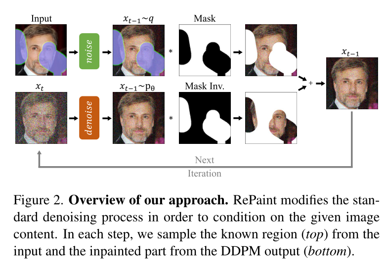

# RePaint: Inpainting using Denoising Diffusion Probabilistic Models

## Abstract

​	自由形式修复是在由任意二进制掩码指定的区域中向图像添加新内容的任务。大多数现有的方法针对特定的掩码分布进行训练，这将它们的泛化能力限制到看不见的掩码类型。此外，基于像素和感知损失的训练通常会导致对缺失区域的简单纹理扩展，而不是语义上有意义的生成。在这项工作中，我们提出了重绘：一种基于去噪扩散概率模型（DDPM）的修复方法，适用于甚至极端的掩码。我们使用预训练的无条件DDPM作为生成先验。为了调节生成过程，我们仅通过使用给定的图像信息对未屏蔽区域进行采样来改变反向扩散迭代。由于该技术不修改或调整原始DDPM网络本身，因此该模型为任何修复形式生成高质量和多样的输出图像。我们使用标准和极端掩码验证了我们的人脸和通用图像修复方法。对于六种掩码分布中的至少五种，重绘优于最先进的自回归和GAN方法。

## 1.Introduction

​	图像修复，也称为图像完成，旨在填充图像中的缺失区域。这样的修复区域需要与图像的其余部分协调，并且在语义上是合理的。因此，修复方法需要强大的生成能力。为此，目前最先进的方法[20,40,48,51]依赖于GANs[8]或自回归模型[33,42,49]。此外，修复方法需要处理各种形式的掩码，如薄或厚的笔刷，方块，甚至是绝大多数图像丢失的极端掩码。这是非常具有挑战性的，因为现有的方法训练具有特定的掩码分布，这可能导致对新掩码类型的泛化性较差。在这项工作中，我们研究了一种替代的生成修复方法，旨在设计一种不需要特定掩码的训练的方法。

​    去噪扩散概率模型（DDPM）是用于生成模型的新范式[12,38]。最近，Dhariwal和Nichol[7]证明，DDPM甚至可以优于最先进的基于GAN的图像合成方法[4]。本质上，DDPM被训练为通过逆扩散过程来迭代地去噪图像。从随机采样的噪声开始，DDPM被迭代地使用一定数量的步骤，产生最终的图像样本。虽然建立在原则性概率模型的基础上，但DDPM已被证明能够生成各种各样的高质量图像[7,12,28]。

​    我们提出**RePaint: an inpainting method that solely leverages an off-the-shelf unconditionally trained DDPM**（RePaint：一种仅利用现成无条件训练的DDPM的修复方法）。具体而言，我们通过在反向扩散迭代期间从给定像素采样来调节生成过程，而不是学习掩码条件生成模型。值得注意的是，==我们的模型因此没有针对修复任务本身进行训练==。这有两个重要的优点。首先，它允许我们的网络在推理过程中推广到任何掩码。其次，它使我们的网络能够学习更多的语义生成能力，因为它具有强大的DDPM图像合成先验（图1）。

​    虽然标准的DDPM采样策略能够产生匹配的纹理，但修复通常在语义上是不正确的。因此，我们引入了一种改进的去噪策略，即重新采样（RePaint）迭代以更好地调节图像。值得注意的是，我们的方法并没有减慢扩散过程[7]，而是在扩散时间上前后移动，产生了具有显著语义意义的图像。我们的方法允许网络在整个推理过程中有效协调生成的图像信息，从而对给定图像信息进行更有效的调节。

​    我们在CelebA-HQ[21]和ImageNet[36]上进行了实验，并与其他最先进的修复方法进行了比较。我们的方法具有更好的泛化性，总体上具有更具语义意义的修复区域。

## 2.Related work

​	图像修复或图像完成的早期尝试利用了输入图像[1–3]或大型图像数据集[10]附近的低水平线索来填充缺失区域。

**Deterministic Image Inpainting（确定性图像修复）：**自GANs[8]引入以来，大多数现有方法遵循Pathak等人[32]首次提出的标准配置，即使用编码器-解码器架构作为主要修复生成器,对抗性训练和针对照片真实性的定制损失。近年来，后续工作取得了令人印象深刻的成果[15,20,30,34,50]。

​	由于图像修复需要高级语义上下文，并且为了明确地将其包括在生成管道中，存在手工构建的架构设计，例如==扩大卷积[16,45]==以增加感受野，==部分卷积[19]和门控卷积[48]==以根据修复掩码引导卷积核，通过==上下文关注==[46]利用全局信息，==边缘图[9,27,43,44]或语义分割图[14,31]==进一步指导生成，==傅立叶卷积[40]==有效地包括全局和局部信息。尽管最近的工作产生了照片逼真的结果，但GANs以纹理合成而闻名，因此这些方法主要用于背景完成或移除对象，这需要重复的结构合成，并且难以进行语义合成（图5）。

**Diverse Image Inpainting（多样性图像修复）：**由于在图像合成期间缺乏控制，大多数基于GAN的图像修复方法易于发生确定性变换。为了解决这一问题，zheng等人[55]和zhao等人[53]提出了一种基于VAE的网络，在多样性和重构之间进行权衡。Zhao等人[54]受StyleGAN2[18]调制卷积的启发，为修复任务引入了一个共调制层，以改善分集和重建。一个新的==自回归方法家族[33,42,49]==，可以处理不规则掩码，最近已成为自由形式图像修复的有力替代方法。

**Usage of Image Prior（使用图像先验）：**在与我们更接近的另一个方向上，Richardson等人[35]在成功修复缺失区域之前利用了StyleGAN[17]。然而，与利用StyleGAN潜在空间的超分辨率方法[5,26]类似，它仅限于人脸等特定场景。值得注意的是，Ulyanov等人[41]表明，非训练生成器网络的结构包含可用于输入和其他应用的固有先验。与这些方法相反，我们利用了预训练去噪扩散概率模型[12]（DDPM）的高表达能力，因此将其用作一般图像修复的先验。我们的方法为语义有意义的生成和纹理合成生成非常详细,高质量的图像。此外，我们的方法没有针对图像修复任务进行训练，而是充分利用了先前的DDPM，因此每个图像都是独立优化的。

**Image Conditional Diffusion Models（图像条件扩散模型）：**SohlDickstein等人[38]的工作将早期扩散模型应用于修复。最近，Song等人[39]开发了一种基于分数的公式，使用随机微分方程生成无条件图像，并将其应用于修复。然而，这两项工作仅显示了定性结果，并且与其他修复方法没有比较。相反，我们的目标是提高图像修复的艺术水平，并与文献中最具竞争力的方法进行全面比较。

​    另一个研究方向是基于DDPM的方法的引导图像合成[6,25]。在ILVR[6]的情况下，使用来自条件图像的低频信息来引导训练的扩散模型。然而，这种调节策略不能用于修复，因为在被掩蔽的区域中不存在高频和低频信息。[25]提出了另一种图像条件合成方法。通过在某个中间扩散时间从引导图像初始化反向扩散过程来执行引导生成。进一步采用迭代策略，将反向过程重复数次，以改进协调。由于需要引导图像来在中间时间步骤开始反向过程，因此该方法不适用于修复，在修复中，新的图像内容只需要根据非掩码像素生成。此外，本文中提出的重采样策略不同于并行[25]。我们通过完全反向扩散过程，从结束时间开始，在每个步骤中来回跳跃固定数量的时间步骤，以逐步提高生成质量。

   尽管我们提出了一种控制无条件训练模型的方法，但concurrent work [29]仍然由classifier-free指导[13]（出自Classifier-Free Diffusion Guidance），用于训练图像条件扩散模型。图像处理的另一个方向是使用扩散模型进行图像到图像的转换，如concurrent work [37]中所述。它训练了一个图像条件DDPM，并展示了一个在修复中的应用。与这两个并行工作不同，我们通过反向扩散过程本身利用无条件DDPM和唯一条件。它使我们的方法可以毫不费力地推广到任何掩码形状，以进行自由形式的修补。此外，我们提出了一种用于反向处理的采样计划，这大大提高了图像质量。

## 3. Preliminaries: Denoising Diffusion Probabilistic Models（DDPM）

​	在本文中，我们使用扩散模型[38]作为生成方法。与其他生成模型一样，DDPM学习给定训练集的图像分布。推理过程通过对随机噪声矢量$x_T$进行采样并逐渐对其进行去噪，直到其达到高质量输出图像$x_0$。在训练期间，DDPM方法定义了一个扩散过程，将图像$x_0$在T个时间步长中转换为高斯白噪声$x_T∼ {\cal N}(0,1)$。扩散过程上的每一步由下式给出， 
$$
q(x_t|x_{t-1})={\cal N}(x_t;\sqrt{1-\beta_t}x_{t-1},\beta_t\pmb{I})\qquad(1)
$$
​	通过在时间步长t处添加方差为$β_t$的高斯噪声，并根据方差表缩放前一个样本$x_{t-1}$和$$\sqrt{1-\beta_t}$$获得样本$x_t$。

​	对DDPM进行训练，以反转(1)中的过程。逆扩散过程由预测高斯分布的参数$\mu_{\theta}(x_t,t)$和$\sum_\theta(x_t,t)$​的神经网络建模，
$$
p_\theta(x_{t-1}|x_t)={\cal N}(x_{t-1};\mu_\theta(x_t,t),\sum\theta(x_t,t))\qquad(2)
$$
​	模型(2)的学习目标通过考虑变分下界而导出， 
$$
E[-\log p_\theta(X_0)] \leq E_q[-\log]\frac{p_\theta(X_{0:T})}{q(X_{1:T}|X_0)}=E_q[-\log p(X_T)-\sum_{t\geq 1}\log p\frac{p_\theta(X_{t-1}|X_t)}{q(X_t|X_{t-1})}]=L\qquad(3)
$$
​	如Ho等人[12]所述，这种损失可以进一步分解为， 
$$
E_q[\underbrace{D_{KL}(q(X_T|X_0)||p(X_T))}_{L_T}+\sum_{t>1}\underbrace{D_{KL}(q(X_{t-1}|X_t,X_0)||p_{\theta}(X_{t-1}|X_t))}_{L_{t-1}}-\underbrace{\log p_{\theta}(X_0|X_1)}_{L_0}]\qquad(4)
$$
​	重要的是，损失$L_{t-1}$训练网络(2)以执行一个反向扩散步骤。此外，由于$q(X_{t-1}|X_t,X_0)$也是一个高斯分布，所以$L_{t-1}$的表达式可以精确给出。

​	如Ho等人[12]所述，参数化模型的最佳方法是预测添加到当前中间图像$x_t$的累积噪声$\epsilon_0$。因此，我们得到预测平均值$\mu_\theta(x_t,t)$​的以下参数变化，
$$
\mu_\theta(x_t,t)=\frac{1}{\sqrt{\alpha_t}}\bigg(x_t-\frac{\beta_t}{\sqrt{1-\overline{\alpha}_t}}\epsilon_\theta(x_t,t)\bigg)\qquad(5)
$$
​	从(4)中的$L_{t-1}$，Ho等人[12]推到了以下简化训练目标，
$$
L_{simple}=E_{t,x_0}[||\epsilon-\epsilon_\theta(x_t,t)||^2]\qquad(6)
$$
​	正如Nichol和Dhariwal[28]所介绍的，学习反向过程(2)中的方差$\sum_\theta(x_t,t)$有助于将采样步骤的数量减少一个数量级。因此，它们增加了变分下界损失。具体而言，我们的训练和推理方法基于最近的工作[7]，这进一步将推理时间缩短了四倍。

​	为了训练DDPM，我们需要一个样本$x_t$和用于将$x_0$转换为$x_t$的相应噪声。通过使用在每个步骤(1)添加的噪声的独立性，我们可以计算总噪声方差为$\overline{\alpha}_t=\prod_{s=1}^t(1-\beta_s)$。因此我们可以作为单个步骤重写(1)，
$$
q(x_t|x_0)={\cal N}(x_t;\sqrt{\overline{\alpha}_t}x_0,(1-\overline{\alpha}_t)\pmb{I}))\qquad(7)
$$
​	它允许我们有效地对训练数据对进行采样，以训练反向转换步骤。 

## 4.Method

​	在本节中，我们首先在第4.1节中介绍了用于图像修复的无条件DDPM的反向扩散过程的调节方法。然后，我们在4.2节中介绍一种改进用于修复的逆扩散过程本身的方法。 

### 4.1 Conditioning on the known Region(已知区域上的条件)

​	修复的目标是使用掩码区域作为条件来预测图像的缺失像素。在本文的剩余部分，我们考虑了一个经过训练的无条件去噪扩散概率模型(2)。我们将ground truth表示为$x$,未知像素表示为$m\bigodot x$，已知像素为$(1-m)\bigodot x$。

​	因为从$x_t$到$x_{t-1}$的每个反向步骤(2)仅取决于$x_t$，我们可以改变已知区域$(1-m)\bigodot x_t$，只要我们保持相应分布的正确性质。由于前向过程由附加高斯噪声的马尔科夫链(1)定义，因为我们可以使用(7)在任何时间点对中间图像$x_t$进行采样。这允许我们对已知区域$m\bigodot x_t$在任何时间点$t$​进行采样。因此，对于未知区域使用(2)，对已知区域使用(7)，我们在我们的方法中对于一个反向步骤实现了以下表达式，
$$
x_{t-1}^{known}\sim {\cal N}(\sqrt{\overline{\alpha}_t}x_0,(1-\overline{\alpha}_t)\pmb{I})\qquad(8a)\\
x_{t-1}^{unknown}\sim \cal N(\mu_\theta(x_t,t),\sum\theta(x_t,t))\qquad(8b)\\
x_{t-1}=m\bigodot x_{t-1}^{known}+(1-m)\bigodot x_{t-1}^{unknown}\qquad(8c)
$$
​	因此，$x_{t-1}^{known}$使用给定图像$m\bigodot x_0$中的已知像素进行采样，而$x_{t-1}^{unknown}$则在给定上一次迭代$x_t$的情况下从模型中进行采样。然后使用掩码将它们组合到新的样本$x_{t-1}$中。我们的方法如图2所示。

### 4.2 Resampling（重采样）

​	当直接应用第4.1节中描述的方法时，我们发现只有内容类型与已知区域匹配。例如，在图3 (n=1)中，未涂漆区域是与狗的毛发匹配的毛茸茸的纹理。虽然修复区域与相邻区域的纹理匹配，但在语义上是不正确的。因此，DDPM利用了已知区域的上下文，但与图像的其余部分不协调。接下来，我们讨论这种行为的可能原因。

​	从图2中，我们分析了该方法如何调节已知区域。如图(8)所示，该模型使用$x_t$预测了$x_{t-1}$,其包括DDPM(2)的输出和来自已知区域的样本。然而，使用(7)对已知像素的采样是在不考虑图像的生成部分的情况下执行的，这引入了不协调的内容。尽管模型在每一步中都试图再次协调图像，但它永远不会完全收敛，因为下一步会出现相同的问题。 此外，在每个反向步骤中，由于$\beta_t$的方差调度，图像的最大变化减小。因此，由于灵活性有限，该方法无法纠正导致后续步骤中边界不协调的错误 。因此，模型需要更多的时间，在一个步骤内通过使用生成的信息$x_{t-1}^{unknown}$来协调条件信息$x_{t-1}^{known}$,然后再前进到下一个去噪步骤。

​	由于DDPM经过训练用于生成位于数据分布中的图像，因此它自然地想要生成一致的结构。在我们的重采样方法中，我们使用DDPM的这一属性来协调模型的输入。因此，我们扩散输出$x_{t-1}$，通过(1)重采样$x_t\sim {\cal N}(\sqrt{1-\beta_t}x_{t-1},\beta_t\pmb{I})$，将$x_{t-1}$返回$x_t$。尽管此操作会缩小输出并增加噪声 ，生成区域$x_{t-1}^{unknown}$中的一些信息仍然保存在$x_t^{unknown}$中。它产生了一个新的$x_t^{unknown}$，它与$x_t^{known}$更加协调，并且包含了来自它的条件信息。

​	由于此操作只能协调一个步骤，因此可能无法在整个去噪过程中合并语义信息。为了克服这个问题，我们将此操作的时间范围表示为跳跃长度，对于前一种情况，跳跃长度为j=1。类似于扩散速度的标准变化[7]（也称为减速），重采样也增加了反向扩散的运行时间。通过减少每个去噪步骤中的附加方差，减速应用更小但更多的重采样步骤。然而，这是一种根本不同的方法，因为减慢扩散仍然存在不协调图像的问题，如我们的重采样策略中所述。我们在第5.6节中以经验证明了我们方法的这种优势。

## 5.Experiments

​	我们对面部和一般修复进行了广泛的实验，与最先进的解决方案进行了比较，并进行了烧蚀分析。在第5.3节和第5.4节中，我们分别报告了掩码鲁棒性和多样性的详细讨论。我们还在附录中报告了其他结果,分析和视觉效果。

### 5.1 Implementation Details

​	我们通过CelebA-HQ[21]和Imagenet[36]数据集验证了我们的解决方案。由于我们的方法依赖于预训练的引导扩散模型[7]，我们使用提供的ImageNet模型。对于CelebA-HQ，我们遵循与ImageNet相同的训练超参数。我们使用256×256 crops，分三批，在4张V100 GPU上实验。与预训练的ImageNet模型相比，CelebA-HQ one在大约五天内仅训练了250000次迭代。请注意，我们在主要论文中的所有定性和定量结果都是针对256图像大小的。

​	对于我们的最终方法，我们使用T=250个时间步长，并应用r=10次重采样，跳跃大小j=10。 

### 5.2 Metrics

​	我们在下面描述的用户研究中比较了重新绘制和基线方法。向用户显示带有空白缺失区域的输入图像。在这张图片旁边，我们展示了两种不同的修复方案。要求用户选择“哪个图像看起来更逼真？”。因此，用户根据基线结果评估重新绘制的真实性。为了避免用户偏向于一种方法，这些方法被匿名化，并以不同的随机顺序显示在每张图像上。此外，每个用户每个问题都会被问两次，如果他们的答案至少有75%与自己一致，则只能提交答案。在100%的情况下，自一致性通常是不可能的，因为例如，LaMa方法可以具有非常类似于在其提供的掩码设置上重新绘制的质量。我们的用户研究评估了测试数据集CelebA-HQ和ImageNet的所有100张测试图像，包括以下掩码：宽,窄,每秒一行,半幅图像,扩展和超分辨率。我们对每个图像查询使用五个不同人类的答案，在每个数据集和掩码设置中，每个方法对方法的比较得到1000个投票，并在平均投票旁边显示95%的置信区间。除了用户研究之外，我们还报告了常见的感知度量LPIPS[52]，这是一种基于AlexNet深度特征空间的学习距离度量。我们计算用户研究中使用的相同100个测试图像的LPIP。结果如表1所示。此外，更多定量结果请参见附录。

### 5.3 Comparison with State-of-the-Art（与现有技术的比较）

​	在本节中，我们首先将我们的方法与最先进的标准掩码分布（通常用于基准测试）进行比较。然后，我们分析了我们的方法相对于其他方法的泛化能力。为此，我们评估了它们在四种具有挑战性的掩码设置下的鲁棒性。首先，两个不同的掩码探测这些方法是否可以合并来自薄结构的信息。第二，两个掩码需要修复图像的大连接区域。表1中报告了所有定量结果，图4和图5中报告了视觉结果。 

​	**Methods:**我们将我们的方法与几种最先进的基于自回归或基于GAN的方法进行了比较。自回归方法是DSI[33]和ICT[42]，GAN方法是DeepFillv2[47],AOT[51]和LaMa[40]。我们使用他们公开提供的预训练模型。我们在CelebA-HQ测试中使用了现有的FFHQ[17]预训练的ICT模型。由于LaMa不提供ImageNet模型，我们使用原始实现对其系统进行了300000次迭代，每次迭代的批量为5。

​	**Settings:**我们使用来自CelebA-HQ[21]和ImageNet测试集的100幅大小为256×256的图像。表1显示了用户研究所得的LPIP和平均投票数。此外，请参阅附录，了解Place2[56]数据集的定性和定量结果。 

​	**Wide and Narrow masks:**为了在标准图像修复场景中验证我们的方法，我们对宽和窄掩码使用了LaMa[40]设置。无论是宽设置还是窄设置，在CelebA-HQ和ImageNet中，重绘都优于所有其他方法，显著幅度为95%。参见图4和图5中的定性结果和表1中的定量结果。最佳自回归方法ICT似乎具有较少的全局一致性，如第二行图4中所示，眼睛不太匹配。一般来说，最佳GAN方法LaMa[40]具有更好的全局一致性，但它产生了臭名昭著的棋盘伪影。这些观察结果可能会影响用户对大多数图像的重新绘制投票，在这种情况下，我们的方法会生成更真实的图像。 

​	**Thin Masks:** 与最近邻超分辨率问题类似，“超分辨率2×”掩码仅在高度和宽度维度上留下步长为2的像素，而“交替线”掩码在图像的第二行移除像素。如图4和图5所示，AOT[51]完全失败，而其他方法要么产生模糊图像，要么产生可见伪影，要么两者兼而有之。用户研究也证实了这些观察结果，其中RePaint获得了73.1%到99.3%的用户投票。

​	**Thick Masks（厚掩码）:**“Expand”掩码仅在256×256图像中留下64×64的中心裁剪，而“Half”掩码则提供图像的左半部分作为输入。由于上下文信息较少，大多数方法都很困难（见图4和图5）。从质量上讲，LaMa更接近我们，但我们生成的图像更清晰，总体上有更多的语义幻觉。值得注意的是，对于CelebA和ImageNet（表1），LaMa在“Expand”和“Half”上的LPIPS优于RePaint。我们认为，这种行为是由于我们的方法在这一代人中更加灵活多样。通过生成与ground truth中的图像在语义上不同的图像，它使LPIPS成为不适合此特定解决方案的度量。 

​	基线产生的伪影可以通过对训练掩码的强过拟合来解释。相反，由于我们的方法不涉及掩码训练，我们的重绘可以处理任何类型的掩码。在大面积修补的情况下，重新绘制会产生语义上有意义的填充，而其他绘制会生成伪影或复制纹理。最后，除表1所示的“Half”掩码的ICT的不确定结果外，用户以95%的置信度首选RePaint。 

### 5.4 Analysis of Diversity

​	如(2)所示，每个反向扩散步骤本质上是随机的，因为它包含来自高斯分布的新噪声。此外，由于我们不直接以任何损失引导修复区域，因此模型可以自由修复与训练集语义一致的任何内容。图1说明了我们模型的多样性和灵活性。 

### 5.5 Class conditional Experiment

​	预训练的ImageNet-DDPM能够进行分类条件生成采样。在图6中，我们展示了“Granny Smith”类以及其他类的“Expand”掩码示例。 

### 5.6 Ablation Study

​	**Comparison to slowing down:**为了分析计算预算的增加是否会导致重采样性能的提高，我们将其与第4.2节中描述的常用的减慢扩散过程的技术进行了比较。因此，在图7和表2中，我们使用相同的计算预算对每种设置进行了重采样和扩散速度的比较。我们观察到，重采样使用额外的计算预算来协调图像，而在减慢扩散过程方面没有明显的改进。 

​	**Jumps Length:**此外，为了烧蚀跳跃长度j和重采样次数r，我们研究了表3中的九种不同设置。我们在应用较大跳跃j=10长度时获得了比较小步长步长更好的性能。我们观察到，对于跳跃长度j=1，DDPM更可能输出模糊图像。此外，这种观察在不同数量的重采样中是稳定的。此外，重采样次数增加了性能。 

​	**Comparison to alternative sampling strategy:**为了将我们的重采样方法与SDEdit[25]进行比较，我们首先执行从t=t到t=t/2的反向扩散，以在t=t/2处获得所需的初始修复。然后，我们应用SDEdit的重采样法，该方法将从t=t/2到t=0的反向过程重复数次。结果如表4所示。除了一种“扩展”情况外，我们的方法在所有掩码类型中都实现了显著更好的性能，其中LPIPS>0.6超出了有意义的比较范围。在“超分辨率掩码”的情况下，我们的方法将所有数据集的LPIP降低了53%以上，这清楚地证明了我们的重采样策略的优势。 

## 6. Limitations

​	我们的方法产生清晰,高度详细和语义有意义的图像。我们相信，我们的工作为解决该方法目前的局限性开辟了有趣的研究方向。两个方向特别重要。首先，自然地，DDPM优化每张图片的过程明显慢于基于GAN和自回归的对应过程。这使得目前难以将其应用于实时应用。尽管如此，DDPM越来越受欢迎，最近的文献致力于提高效率[23,24]。其次，对于极端的掩码情况，RePaint可以生成与ground truth非常不同的真实图像。这使得这些条件下的定量评估具有挑战性。另一种解决方案是在测试集上使用FID分数[11]。然而，用于修复的可靠FID通常使用1000多个图像计算。对于当前的DDPM，这将导致运行时间对于大多数研究机构来说是不可行的。 

## 7.Potential Negative Societal Impact（潜在的负面社会影响）

​	一方面，重绘是一种依赖于无条件预训练DDPM的修复方法。因此，该算法可能偏向于其所训练的数据集。由于该模型旨在生成与训练集相同分布的图像，因此可能反映相同的偏见，如性别,年龄和种族。另一方面，重新绘制可以用于面部的匿名化。例如，可以删除公共活动中显示的人的身份信息，并幻觉人造脸以保护数据。 

## 8.Conclusions

​	我们提出了一种新的去噪扩散概率模型来解决图像修复任务。详细地说，我们开发了一种掩码不可知方法，该方法广泛增加了用于自由形式修补的掩码的自由度。由于RePaint的新颖调节方法符合DDPM的模型假设，因此无论掩码的类型如何，它都能产生照片般逼真的图像。

​	
