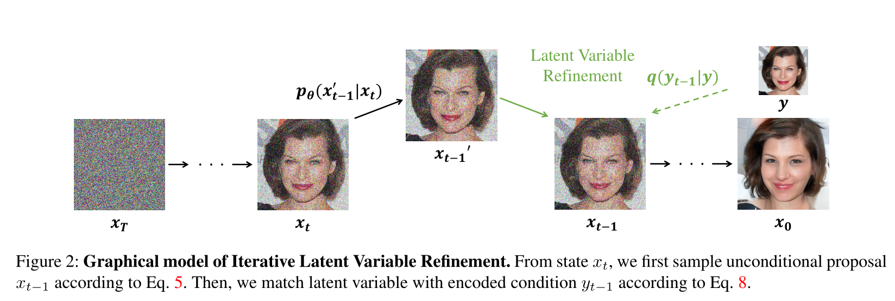
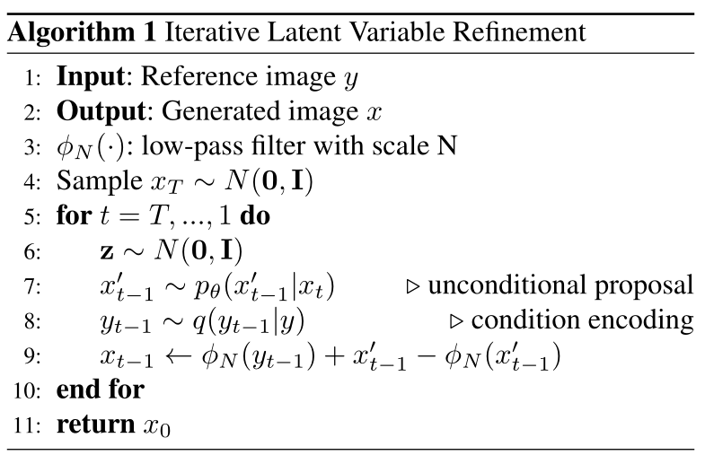
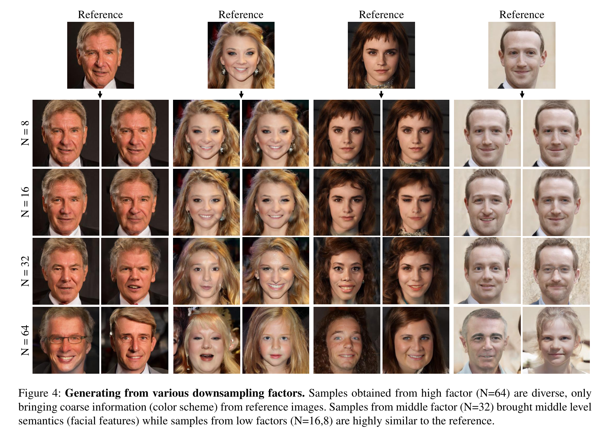

# ILVR: Conditioning Method for Denoising Diffusion Probabilistic Models（用于去噪扩散概率模型的调节方法 ）

## Abstract

​	去噪扩散概率模型（DDPM）在无条件图像生成中表现出显著的性能。然而，由于DDPM中生成过程的随机性，生成具有所需语义的图像具有挑战性。在这项工作中，我们提出了迭代潜变量优化（ILVR），这是一种指导DDPM生成过程的方法，用于基于给定参考图像生成高质量图像。这里，DDPM中生成过程的细化使得单个DDPM能够从参考图像所指示的各种集合中采样图像。所提出的ILVR方法在控制生成的同时生成高质量图像。我们的方法的可控性允许在各种图像生成任务（如从各种下采样因子生成、多域图像翻译、绘制到图像以及使用涂鸦进行编辑）中，在不需要任何额外学习的情况下对单个DDPM进行适配。我们的代码位于：https://github.com/jychoi118/ilvr_adm. 

## 1. Introduction

​	生成模型，如生成对抗网络（GAN）[3,10,19]、归一化流[21]和变分自动编码器[42]，在图像生成中表现出显著的质量，并已应用于多种目的，如图像到图像翻译[7,11,31,32,35,47]和图像编辑[1,12,36]。

​	主要有两种方法来控制生成模型以根据需要生成图像：==一种是通过为所需目的设计条件生成模型，另一种是利用性能良好的无条件生成模型 。==

​	第一种方法通过在训练过程中提供所需条件来学习控制，并在各种任务上表现出出色的性能，如分割掩码条件生成[31，59]、样式转换[9，50]和修复[23，52]。第二种方法利用高质量生成模型，如StyleGAN[19，20]或BigGAN[3]。Shen等人[36]和Härkönen等人[12]通过分析预训练生成模型的潜在空间来操纵图像的语义属性，而Huh等人[16]和Zhu等人[57]通过将图像投影到潜在空间来执行图像编辑。 

​	去噪扩散概率模型（DDPM）[14,39]是一种迭代生成模型，在无条件图像生成中显示出与最新模型相当的性能。DDPM学习建模从简单分布到数据分布的马尔可夫转换，并通过顺序随机转换生成不同的样本。从DDPM获得的样本取决于简单分布的初始状态和每个跃迁。然而，控制DDPM生成具有期望语义的图像是一个挑战，因为转换的随机性生成具有不一致的高级语义的图像，即使是从相同的初始状态。 

​	在这项工作中，我们提出了一种无学习的方法，迭代潜变量优化（ILVR），以使生成过程在良好的无条件DDPM中运行。利用给定的参考图像来细化生成过程中的每个转换。通过匹配每个潜在变量，ILVR确保每个转换中的给定条件，从而能够从条件分布进行采样。因此，ILVR生成共享所需语义的高质量图像。 

​	我们描述了我们方法的用户可控性，这使得能够控制生成的图像与参考的语义相似性。图1(a)和图4展示了共享从粗略到精细信息的语义的样本。此外，可以从看不见的数据域中选择参考图像。从这些特性出发，我们被激励利用在单数据域到多域图像转换上学习的无条件DDPM；这是一项具有挑战性的任务，现有工作必须学习多个数据域。此外，我们将我们的方法扩展到绘制图像和使用涂鸦进行编辑（图1(c)和(d)）。我们证明，我们的ILVR能够在这些不同的任务上利用单个无条件DDPM模型，而无需任何额外的学习或模型。通过测量Fréchet起始距离（FID）和学习的感知图像块相似性（LPIPS），我们确认，我们从各种下采样因子生成的方法在保持视觉质量的同时提供了对多样性的控制。 

​	我们的论文做出了以下贡献： 

- 我们提出了ILVR，一种通过将每个潜在变量与给定参考图像匹配来细化生成过程中的每个过渡的方法。 
- 我们研究了几个属性，这些属性允许用户对引用的语义相似性进行控制。 
- 我们证明，我们的ILVR能够在各种图像生成任务中利用无条件DDPM，包括多域图像翻译、绘制图像和使用涂鸦进行编辑。 

## 2.Background

​	去噪扩散概率模型（DDPM）[14,39]是一类生成模型，在无条件图像生成中表现出优异的性能[14]。它学习马尔可夫链，将简单分布（如各向同性高斯分布）逐渐转换为数据分布。 生成过程学习DDPM正向（扩散）过程的反向，即当顺序采样相同维度的潜在变量$x_1,...,x_T$时，逐渐向数据添加噪声的固定马尔科夫链。这里，正向过程中的每一步都是高斯变换。 
$$
q(x_t|x_{t-1}):=N(x_t;\sqrt{1-\beta_t}x_{t-1},\beta_t\pmb I),\qquad(1)
$$
​	其中$\beta_1,...,\beta_T$是一个固定的方差序列，而不是学习参数[14]。等式1是通过将小高斯噪声添加到潜在变量来寻找$x_t$的过程。给定干净数据$x_0$，$x_t$的采样以闭合形式表示：
$$
q(x_t|x_0):=N(x_t;\sqrt{\overline{\alpha}_t}x_0,(1-\overline{\alpha}_t)\pmb I),\qquad(2)
$$
​	其中$\alpha_t:=1-\beta_t$和$\overline{\alpha}_t:=\prod_{s=1}^t\alpha_s$。因此$x_t$可以表示为$x_0$和$\epsilon$的线性组合：
$$
x_t=\sqrt{\overline{\alpha}_t}x_0+\sqrt{1-\overline{\alpha}_t}\epsilon,\qquad(3)
$$
​	其中$\epsilon\sim N(0,\pmb I)$具有与数据$x_0$和潜在变量$x_1,...,x_t$相同的维度。

​	由于正向过程$q(x_{t-1}|x_t)$是难以处理的，DDPM学习参数化高斯变换$p_\theta(x_{t-1}|x_t)$。生成（或反向）过程具有与正向过程相同的函数形式[39]，并表示为具有学习均值和固定方差的高斯变换[14]：
$$
p_\theta(x_{t-1}|x_t)=N(x_{t-1};\mu_\theta(x_t,t),\sigma^2\pmb I).\qquad(4)
$$
​	此外，通过将$\mu_\theta$分解为$x_t$和噪声近似器$\epsilon_\theta$的线性组合，生成过程表示为：
$$
x_{t-1}=\frac{1}{\sqrt{\alpha_t}}(x_t-\frac{1-\alpha_t}{\sqrt{1-\overline{\alpha}_t}}\epsilon_\theta(x_t,t))+\sigma_t\pmb z,\qquad(5)
$$
​	其中$\pmb z\sim N(0,\pmb I)$，这表明每个生成步骤是随机的。多个随机过程步骤导致难以控制DDPM生成过程。$\theta$表示具有相同输入和输出维度的神经网络，并且神经网络在每个步骤中预测的噪声用于等式5中的去噪过程。

## 3. Method

​	利用DDPM的能力，我们提出了一种控制无条件DDPM的方法。我们在第3.1节中介绍了我们的方法，迭代潜变量细化（ILVR）。第3.2节研究ILVR的几个特性，这些特性促使控制两个因素：==下采样因子==和==调节范围==。 

### 3.1 Iterative Latent Variable Refinement（迭代潜变量优化）

​	在本节中，我们介绍了迭代潜变量细化（ILVR），这是一种调节无条件DDPM模型生成过程的方法，用于从给定参考图像生成共享高级语义的图像。 为此，我们使用条件$c$从条件分布$p(x_0|c)$中采样图像：
$$
p_\theta(x_0|c)=\int p_\theta(x_{0:T}|c)dx_{1:T},\\
p_\theta(x_{0:T}|c)=p(x_T)\prod_{t=1}^Tp_\theta(x_{t-1}|x_t,c).\qquad(6)
$$
​	生成过程的每个转换$p_\theta(x_{t-1}|x_t,c)$取决于条件$c$。然而，无条件训练的DDPM表示无条件转移$p_\theta(x_{t-1}|x_t)$的值。我们的ILVR模型提供条件$c$到无条件转换$p_\theta(x_{t-1}|x_t)$，无需额外学习或模型。

​	设$\phi_N(\cdot)$表示==线性低通滤波操作==，即按因子$N$进行下采样和上采样的序列，因此可以保持图像的维数。给定参考图像$y$，条件$c$确保生成图像$x_0$的下采样图像$\phi_N(x_0)$等于$\phi_N(y)$。利用等式3的正向过程$q(x_t|x_0)$和$\phi_N$的线性性质，条件$c$下的每个马尔科夫变换近似如下：
$$
p_\theta(x_{t-1}|x_t,c)\approx p_\theta(x_{t-1}|x_t,\phi_N(x_{t-1})=\phi_N(y_{t-1})),\qquad(7)
$$
​	其中，$y_t$可以按照等式3进行采样。==从$x_t$到$x_{t-1}$的每个转换中的添加$c$可以用局部条件代替==，其中潜在变量$x_{t-1}$和损坏的引用$y_{t-1}$共享低频内容。为了确保每个转换中的局部条件，我们首先使用DDPM计算从$x_t$到$x_{t-1}^{'}$的无条件proposal分布。然后，由于操作$\phi$保持维数，我们通过将proposal $x_{t-1}^{'}$的$\phi(x_{t-1}^{'})$和$y_{t-1}$的$\phi(y_{t-1})$进行匹配来优化proposal分布，如下：
$$
x_{t-1}^{'}\sim p_\theta(x_{t-1}^{'}|x_t),\\
x_{t-1}=\phi (y_{t-1})+(\pmb I-\phi)(x_{t-1}^{'}).\qquad(8)
$$
​	通过匹配等式8之后的潜在变量，ILVR确保等式7中的局部条件，从而实现无条件DDPM的条件生成。图2和算法1说明了我们的ILVR。虽然我们通过对无条件建议分布的简单修改来近似条件转换，但图1(a)和图4显示了共享参考语义的各种高质量样本。 





考虑以下算法：

```
Algorithm 2 inpainting
Input:masked image y
Output:inference image x
phi_N(·):low-pass filter with scale N
Sample xT~N(0,I)
for t=T,...1,do
	z~N(0,I)
	x_t-1^'~p_theta(x_t-1^'|xt)		unconditional proposal
	y_t-1~q(y_t-1|y_t)	condition encoding
	x_t-1 <--- phi_N(y_t-1)+x_t-1^'-phi_N(x_t-1^')
end for
return x0
```


### 3.2. Reference selection and user controllability

​	设$\mu$为无条件DDPM可以生成的图像集。我们的方法允许从给定参考图像$y$的条件分布中采样。换句话说，我们从$\mu$的子集中采样图像，该子集由参考图像引导。 

​	为了将我们的方法扩展到各种应用，我们研究了:(1)<font color='cornflowerblue'>参考图像选择的最低要求</font>和(2)<font color='cornflowerblue'>参考定向子集的用户可控性</font>，这定义了与参考的语义相似性。为了提供参考选择和控制的直观性，我们研究了几个属性。图3可视化了每个生成步骤中的ILVR，以引导参考所指示的子集。 

​	我们还将子集表示为：
$$
R_N(y)=\{x:\phi_N(x)=\phi_N(y) \},\qquad(9)
$$
​	表示图像集$x\in \R^{H\times H}$，其等效于下采样的参考图像$y$。我们通过扩展上述符号来考虑一系列调节步骤：
$$
R_{N,(a,b)}(y)=\{x:\phi_N(x_t)=\phi_N(y_t),t\in [b,a] \},\qquad(10)
$$
​	其中$R_{N,(a,b)}(y)$表示步骤$b$到步骤$a$中与潜在变量（算法1的第9行）匹配的图像的分布。现在我们将讨论参考选择和子集控制的几个属性。

​	**属性1.**  参考图像可以是从集合中选择的任何图像：
$$
Y=\{y:\phi_N(y)=\phi_N(x),x\in \mu \},\qquad(11)
$$
​	参考图像只需要匹配学习数据分布的低分辨率空间。甚至来自不可见数据域的参考图像也是可能的。因此，我们可以从看不见的数据域中选择一个参考，并执行多域图像转换，如第4.2节所示。

​	**属性2.**  考虑下采样因子$N$和$M$，其中$N\leq M$，
$$
R_N\subset R_M\subset\mu,\qquad(12)
$$
​	这表明较高的因子对应于较宽的图像子集。 

​	由于==更高的因子$N$使得能够从更广泛的图像集合中进行采样，采样的图像更加多样，并且与参考的语义相似性更低==。在图4中，与参考图像的感知相似性由下采样因子控制。从较高因子$N$获得的样本共享参考的粗特征，而从较低因子$N$得到的样本也共享更精细的特征。注意，由于$R_N$是$\mu$的子集，我们的采样方法保持了无条件DDPM的样本质量。



​	**属性3.**  限制调节步骤的范围使得能够从更宽的子集进行采样，同时仍然保证从学习的图像分布进行采样。 
$$
R_N\subset R_{N,(T,k)}\subset\mu.\qquad(13)
$$
​	图5示出了当逐渐限制条件步骤的范围时生成的图像的趋势。与改变下采样因子相比，改变调节范围对样本多样性具有细粒度影响。 

## 4. Experiments and Applications

​	如前所述，ILVR生成高质量图像，并允许控制与参考图像的语义相似性。我们首先在第4.1节中展示了受控生成的定性结果。然后我们在第4.2节，第4.3节，和第4.4节中展示了各种图像生成任务的ILVR。第4.5节对ILVR的视觉质量和多样性进行了定量评估。

​	我们在FFHQ[19]、MetFaces[18]、AFHQ[7]、LSUN-Church[51]和Places365数据集[56]上训练了DDPM模型，以证明其在各种任务的适用性。我们使用了正确实现的调整大小库[37]进行操作。参考人脸图像来自网络，在训练过程中看不到。有关实施和评估的详细信息，请参见补充材料。 

### 4.1 Qualitative Results on User Controllability

​	与参考的语义相似性基于下采样因子$N$和条件步长范围$[b,a]$而变化。在图4中，从通过各种因素下采样的参考图像生成图像。如等式12所述，随着因子$N$的增加，样本更加多样化，在感知上与参考不太相似。例如，从$N=8$获得的样本在细节（如卷发、眼睛颜色、耳环）上与参考不同，而从$N=64$获得的样本与参考仅共享粗略特征（如颜色方案）。用户对参考相似性的可控性支持单个预训练模型对各种任务的无学习自适应，如下文所述。 

​	除了我们复制的模型外，我们还利用了公开可用的引导扩散[8]，最近最先进的DDPM。图9显示了使用在LSUN[51]数据集上训练的无条件模型生成的样本。样本共享参考中的粗（$N=64$）或细（$N=16$）特征。这些结果表明，我们的方法可以应用于任何无条件DDPM，无需再训练。 

​	图5示出了通过改变调节步骤的范围而产生的样本。在这里，较窄的范围允许根据等式13从较宽的子集进行图像采样，从而产生不同的图像。调节不到500步，面部特征与参考不同。下采样因子和调节范围提供了用户可控性，其中后者对样本多样性具有更精细的控制。 

### 4.2 Multi-Domain Image Translation

​	图像到图像翻译旨在学习两个视觉域之间的映射。更具体地说，生成的图像需要采用目标域的纹理，同时保留输入图像的结构[30]。IL  VR通过匹配参考图像中的粗略信息来执行此任务。我们选择$N=32$以保留参考的粗略结构。 

​	图6中的前两行显示了在FFHQ[19]数据集上训练的DDPM模型生成的样本，该数据集包含高质量的人脸照片。来自人像[18]参考文献的样本表明，成功地将其转化为照片逼真的人脸。我们还从照片中生成了人像，DDPM在人脸人像数据集METFACES[18]上进行了训练。这里，生成了不同的样本，然而，一些现有的图像翻译模型[17,30]无法生成随机样本。 

​	通常，图像翻译模型[7,17,24,58]，包括多域翻译模型[6,15]，学习不同域之间的翻译。因此，它们只能从训练阶段学习的领域进行翻译。然而，ILVR仅需要在目标域上训练单个模型。因此，ILVR支持从未知的源域进行图像翻译，如等式11所示，参考图像来自学习数据集的低分辨率空间。补充材料中介绍了与现有翻译模型的定量比较。

​	通过在AFHQ狗上训练的DDPM模型[7]，我们翻译了来自验证集的狗、猫和野生动物的图像。图6的第四至第六行显示了结果。仅在狗图像上训练的DDPM模型将看不见的猫和野生动物图像很好地转换为狗图像。 

### 4.3. Paint-to-Image

​	“绘画到图像”是将不自然的绘画转化为写实图像的任务。我们使用在Places365[56]的瀑布类别上训练的模型来验证我们对该任务的扩展。 

​	如图7所示，剪贴画、油画和水彩画被很好地转化为照片逼真的图像。绘画和写实图像在细节纹理上有所不同。我们选择了N=64的系数，以仅保留参考的粗略方面（例如，颜色方案）。从等式11，我们可以推断，给定的绘画共享学习数据集的粗糙特征。

### 4.4. Editing with Scribbles

​	我们将我们的方法扩展到使用用户涂鸦执行版本的应用，这也在Image2StyleGAN++[2]中介绍。我们使用在LSUN  Church[51]和FFHQ[19]上训练的DDPM生成样本。在验证集的参考图像上，我们添加了涂鸦。然后，在1000到200的时间步长上以因子N＝8提供涂鸦图像作为参考，以便既保持原始图像的细节，又协调涂鸦。有趣的示例如图8所示。在第二行，DDPM在中间生成“Shutterstock”水印，在底部生成文章编号。由于这对水印和文章编号在数据集中很常见，DDPM从底部的白色涂鸦中生成了这些特征。更多示例请参见补充。 

### 4.5. Quantitative Evaluation

​	我们使用广泛使用的FID[13]和LPIPS[55]评估了生成图像的质量和多样性。FID分数评估真实图像分布和生成图像分布之间的视觉质量和距离。LPIPS测量两幅图像之间的感知相似性。 

​	表1报告了在FFHQ[19]和METFACES[18]数据集上训练的模型从每个下采样因子N和无条件生成中测量的FID分数。分数（越低越好）与无条件模型基本相当，表明我们的条件方法不会损害无条件模型的生成质量。此外，较低下采样因子的FID分数更好，因为较低因子生成的图像与参考图像几乎完美对齐。 

​	为了评估来自同一参考的样本之间的多样性，我们为每个参考图像生成了10幅图像，并根据StarGAN2[7]计算了平均成对（45对）LPIPS距离。表2显示，因子N越高，LPIP越高，因此，如等式12所示，生成的样本越多样。相反，N越低的样本共享参考文献中的更多内容，因此多样性越低。 

## 5. Related Work

### 5.1. Iterative generative models

​	成功的迭代生成模型会逐渐向数据中添加噪声，并学会逆转这一过程。基于分数的模型[40，41]估计分数（对数似然梯度），并使用Langevin  dynamics对图像进行采样。使用去噪分数匹配[45]以可缩放的方式学习分数。DDPM[14，39]学习反转破坏数据的扩散过程，并利用扩散和反转过程的相同功能形式。Ho等人[14]通过实现极低的FID，显示了图像生成的优异性能。扩散模型在语音合成[5，22]和点云生成[25]等其他领域也表现出优异的性能。我们的调节方法允许这种强大的DDPM用于各种目的。 

### 5.2. Conditional generative models

​	根据输入类型，如类别标签[3,43,54]、分割掩码[31,47]、分类器特征[28,38]和图像[17,26]，可以使用各种条件生成模型。采用图像作为条件的研究始于Isola等人[17]，并扩展到无监督[15、58]、少镜头[24]和多域图像翻译[7]。与我们的工作同时，SR3[34]训练了条件DDPM以实现超分辨率。然而，这些模型仅在期望的设置下显示出显著的性能。相反，我们演示了单个无条件模型对各种应用的适应性。 

### 5.3. Leveraging unconditional models

​	正在研究如何将预训练的无条件生成器用于各种目的，如图像编辑[2，36]、风格转换[1]和超分辨率[11，26]。具体而言，通过将给定图像投影到潜在向量[1、2、4、49、57]中并对其进行操作[6、11、12、26、36]，可以轻松编辑图像。利用无条件模型的能力，这些作品展示了高质量的图像。GAN[10]是这些作品的基石。然而，我们使用了迭代生成模型，DDPM，这在本文中还没有探讨。 

### 5.4. High-level semantics（高级语义）

​	CNN特征[38]、分割掩码[31]和低分辨率图像[26、46]中包含的图像语义被积极用作生成模型中的条件。根据我们在等式6中的推导，各种语义条件，如特征或分段，可以提供高级语义。然而，它们需要额外的模型（分类器或分割模型）。由于我们对在没有任何附加模型的情况下控制DDPM感兴趣，我们通过利用DDPM的迭代特性提供了低分辨率图像的语义。 

## 6. Conclusion

​	我们提出了一种无学习的方法来调节无条件DDPM的生成过程。通过使用给定的参考细化每个转换，我们可以从似是而非的图像空间进行采样。此外，下采样因子和调节范围提供了用户对该方法的可控性。我们证明了单个无条件DDPM可以用于各种任务，而无需任何额外的学习和模型。 
